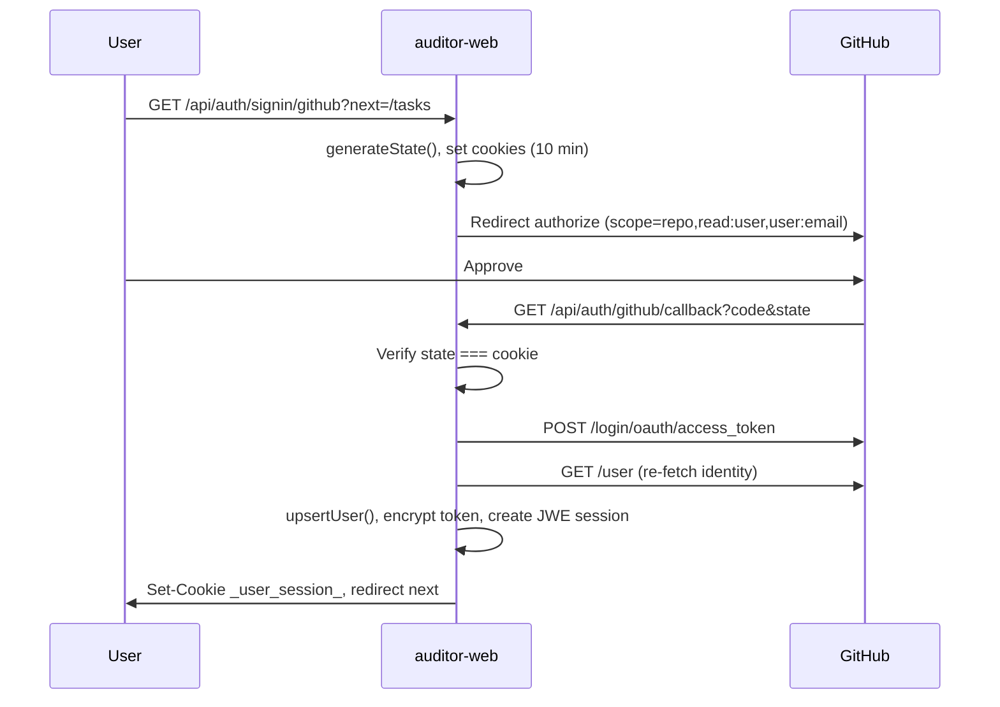
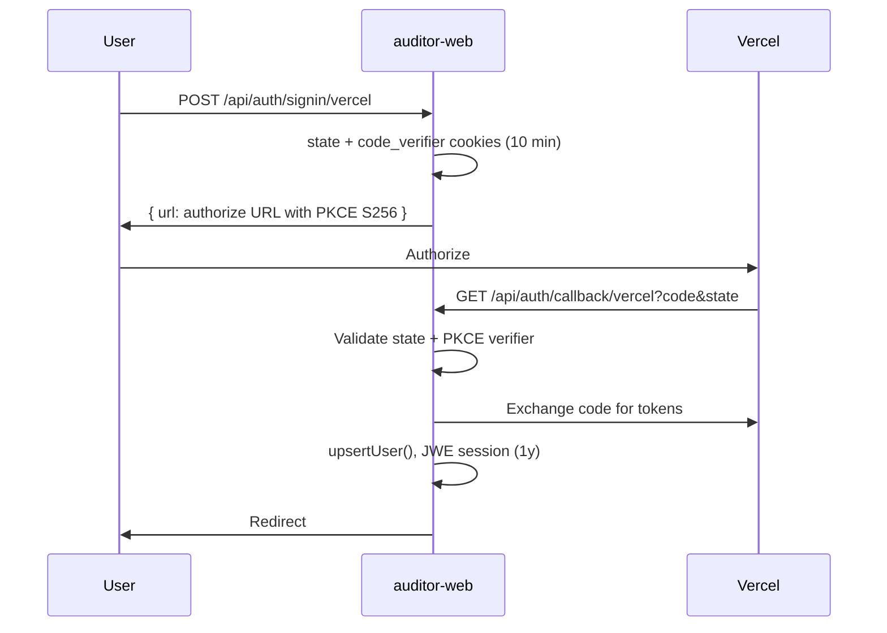

# Auth Engineer Design Document — ARES `auditor-web`

| Field | Value |
|-------|-------|
| **Scope** | `apps/auditor-web` — dual auth (Dashboard JWE + Supabase JWT) |
| **Version** | 2026-08-04 |
| **Status** | Partially implemented — OAuth flows live; Supabase scaffolded; INT-4 unification planned |
| **Related docs** | [security-auditor-web.md](./security-auditor-web.md) · [backend-auditor-web.md](./backend-auditor-web.md) |

---

## 1. Aktor dan Peran

### 1.1 Aktor eksternal

| Aktor | Deskripsi | Identitas canonical |
|-------|-----------|---------------------|
| **Pengguna Dashboard** | Manusia yang login ke UI task/agent via OAuth | Internal `users.id` (nanoid); eksternal `externalId` = GitHub numeric ID atau Vercel UID |
| **GitHub (OAuth Provider)** | Issuer token delegasi repo untuk dashboard | `githubUser.id` (number → string di DB) |
| **Vercel (OAuth Provider)** | Issuer token opsional (primary auth + deploy) | `user.uid || user.id` dari Vercel API |
| **Supabase Auth User** | Pengguna knowledge-base terpisah | UUID `auth.users.id` |
| **Service Role (backend)** | Ingest/recall ARES tanpa login user | `SUPABASE_SERVICE_ROLE_KEY` — bypass RLS |

### 1.2 Dua jalur auth yang **sengaja terpisah**

| Jalur | Cookie / Token | OAuth App | Callback |
|-------|----------------|-----------|----------|
| **Dashboard** | JWE cookie `_user_session_` | GitHub OAuth App #1 (dashboard) | `{origin}/api/auth/github/callback` |
| **Knowledge Base (Supabase v1)** | Supabase session JWT (cookie via `@supabase/ssr`) | GitHub OAuth App #2 (Supabase) | `https://<ref>.supabase.co/auth/v1/callback` |

> **Tidak boleh** mencampur satu OAuth app untuk kedua callback. Unifikasi login direncanakan (INT-4); saat ini independen.

### 1.3 Provider dashboard (`NEXT_PUBLIC_AUTH_PROVIDERS`)

Default: `github`. Opsional: `github,vercel`.

| Provider | Peran | Mode |
|----------|-------|------|
| **GitHub** | Primary auth **atau** connected account | Sign-in / Connect |
| **Vercel** | Primary auth saja | Sign-in only |

**Tidak ada password auth** di dashboard MVP.

### 1.4 Peran Supabase RBAC (`db/supabase/0002_rbac.sql`)

| Role | Permissions |
|------|-------------|
| `admin` | `knowledge.read`, `knowledge.write`, `knowledge.delete` |
| `auditor` | `knowledge.read`, `knowledge.write` |
| `viewer` | `knowledge.read` |

Role di-inject ke JWT claim `user_role` via hook `custom_access_token_hook`. User tanpa baris di `user_roles` → claim `null` → **deny by default** di RLS.

### 1.5 Model kepemilikan dashboard (bukan role-based)

Dashboard **tidak** memakai role admin/auditor/viewer. Otorisasi = **object-level ownership** via `userId` FK di `tasks`, `connectors`, `keys`, `settings`, `accounts`.

---

## 2. Alur Autentikasi

### 2.1 GitHub Sign-In (primary auth)



**Deteksi mode** (`signin/github/route.ts`):
- Session Vercel aktif → **connect flow** (`github_auth_mode=connect`)
- Selain itu → **sign-in flow** (`github_auth_mode=signin`)

**CSRF cookies** (httpOnly, SameSite=Lax, Secure di production, `maxAge: 600` = **10 menit**):
- `github_auth_state`
- `github_auth_redirect_to`
- `github_auth_mode`
- `github_oauth_user_id` (connect flow only)

**GitHub authorization code** expired setelah **10 menit** (per GitHub spec, didokumentasikan di `github-auth.mdx`).

### 2.2 GitHub Connect (Vercel user menautkan GitHub)

Sama dengan sign-in sampai callback, lalu:
1. Token di-encrypt → disimpan di `accounts` (bukan ganti primary provider)
2. `accounts.externalUserId` = `${githubUser.id}` (numeric)
3. Jika GitHub ID sudah terhubung ke user lain → **account merge**: tasks/connectors/accounts/keys dipindah, user lama dihapus
4. **Tidak** membuat JWE session baru (session Vercel tetap)

Legacy route `/api/auth/github/signin` (GET/POST) masih ada; hanya connect, wajib session + `github_oauth_user_id`.

### 2.3 Vercel Sign-In (PKCE)



Cookies OAuth Vercel: `vercel_oauth_state`, `vercel_oauth_code_verifier`, `vercel_oauth_redirect_to` — TTL **10 menit**.

### 2.4 Supabase GitHub Auth (knowledge base, terpisah)

1. Client: `signInWithGithub()` → `supabase.auth.signInWithOAuth({ provider: 'github' })`
2. Redirect ke Supabase → GitHub → Supabase callback
3. App: `GET /auth/callback` → `exchangeCodeForSession(code)` (PKCE)
4. Admin assign role manual:
   ```sql
   INSERT INTO public.user_roles (user_id, role) VALUES ('<uuid>', 'auditor');
   ```

**Tidak mempengaruhi** cookie `_user_session_`.

### 2.5 Session refresh / info

`GET /api/auth/info`:
- **GitHub session:** dikembalikan apa adanya (tidak di-recreate)
- **Vercel session:** di-recreate dari token DB via `createSession()` untuk refresh profil; cookie JWE di-rewrite

### 2.6 Sign-Out

`GET /api/auth/signout?next=/`:
1. Baca session JWE
2. **GitHub primary:** revoke via `DELETE https://api.github.com/applications/{client_id}/token`
3. **Vercel primary:** revoke via `POST https://vercel.com/api/login/oauth/token/revoke`
4. Clear cookie `_user_session_` (Expires epoch)
5. Return `{ url: next }` (relative path only via `isRelativeUrl`)

`signOutSupabase()` terpisah — hanya JWT Supabase.

### 2.7 GitHub Disconnect

`POST /api/auth/github/disconnect`:
- Wajib session
- **Ditolak** jika `authProvider === 'github'` (primary)
- Hapus baris `accounts` where `provider='github'`

---

## 3. Sesi dan Token

### 3.1 Dashboard session (JWE cookie)

| Properti | Nilai |
|----------|-------|
| Cookie name | `_user_session_` (`SESSION_COOKIE_NAME`) |
| Isi payload | `{ created, authProvider, user: { id, username, email, avatar, name? } }` |
| Algoritma JWE | `dir` + `A256GCM` (`lib/jwe/encrypt.ts`) |
| Secret | `JWE_SECRET` (base64url-decoded) |
| TTL cookie | `ms('1y')` → **Max-Age 31.536.000 detik (~365 hari)** |
| JWE `exp` | `'1y'` (sama) |
| Flags | `HttpOnly`, `Path=/`, `SameSite=Lax`, `Secure` (production only) |

**Token OAuth tidak pernah** disimpan di cookie session — hanya di Postgres terenkripsi.

### 3.2 Token at-rest (Postgres)

| Field | Enkripsi | Algoritma |
|-------|----------|-----------|
| `users.access_token`, `users.refresh_token` | `encrypt()` | AES-256-CBC, IV 16 byte random, format `iv:ciphertext` hex |
| `accounts.access_token`, `accounts.refresh_token` | sama | sama |
| `keys.value`, `connectors.env` | sama | sama |
| Key material | `ENCRYPTION_KEY` | 32-byte hex (64 chars) |

Retrieval: `getOAuthToken()` / `getUserGitHubToken()` → `decrypt()`.

**Prioritas GitHub token:**
1. `accounts` (connected)
2. `users` where `provider='github'` (primary)

### 3.3 Identitas GitHub (invariant)

| Lokasi | Field | Format |
|--------|-------|--------|
| `users.external_id` (primary GitHub) | GitHub numeric ID | string, e.g. `"12345678"` |
| `accounts.external_user_id` | GitHub numeric ID | string |
| **Bukan** canonical | `username`, `email`, org slug | Hanya display / fallback email |

Unique index: `(provider, external_id)` di `users`; `(user_id, provider)` di `accounts`.

### 3.4 Supabase JWT

- Dikelola `@supabase/ssr` + cookie Supabase
- Custom claim: `user_role` → `admin | auditor | viewer | null`
- Service role key bypass RLS untuk pipeline server-side

### 3.5 OAuth scopes dashboard GitHub

```
repo,read:user,user:email
```

Disimpan di `users.scope` / `accounts.scope` setelah grant.

### 3.6 Rate limit (bukan auth token, tapi quota)

| Setting | Default | Reset |
|---------|---------|-------|
| `MAX_MESSAGES_PER_DAY` | **5** (env override) | **00:00 UTC** hari berikutnya |
| Per-user override | `settings` key `maxMessagesPerDay` | sama |

Hitung: task baru hari ini + user messages hari ini (exclude soft-deleted tasks).

---

## 4. Model Otorisasi (Matrix: Aktor × Resource × Action)

### 4.1 Dashboard — deny by default, ownership-based

Semua aksi di bawah memerlukan session JWE valid kecuali dinyatakan public.

| Aktor | Resource | Action | Keputusan | Mekanisme |
|-------|----------|--------|-----------|-----------|
| Anonymous | `/`, landing | read | **Allow** | Public page |
| Anonymous | `/api/auth/signin/*`, callbacks | initiate OAuth | **Allow** | Public routes |
| Anonymous | `/api/tasks`, `/api/tasks/[id]/*` | any | **Deny** | 401 Unauthorized |
| Authenticated user | `tasks` (own) | CRUD, sandbox, PR | **Allow** | `tasks.userId === session.user.id` |
| Authenticated user | `tasks` (other user) | any | **Deny** | 404 (tidak leak existence) |
| Authenticated user | `connectors`, `keys`, `settings` | CRUD | **Allow/Deny** | `userId` match |
| Authenticated user | `accounts` (GitHub connect) | connect | **Allow** | OAuth connect flow |
| Vercel user | `accounts` (GitHub) | disconnect | **Allow** | POST disconnect |
| GitHub primary user | `accounts` | disconnect | **Deny** | 400 — primary method |
| Authenticated user | GitHub API (repos, PR) | delegated | **Allow** | `getUserGitHubToken()` — butuh token |
| Authenticated user | `POST /api/tasks`, `continue` | create/message | **Allow/Deny** | rate limit 429 jika exceeded |
| Authenticated user | `/api/auth/rate-limit` | read quota | **Allow** | session required |
| Authenticated user | `/api/auth/info` | read session | **Allow** | returns user profile |
| Authenticated user | `/profile`, `/settings`, `/usage` | read | **Allow** | session optional di profile (degraded UI) |
| Authenticated user | `/tasks` | read | **Allow/Deny** | redirect `/` jika no session |

### 4.2 Supabase Knowledge Base — RBAC via RLS

| Aktor | Resource | Action | admin | auditor | viewer | no role |
|-------|----------|--------|-------|---------|--------|---------|
| `authenticated` + JWT | `documents`, `chunks` | SELECT | Allow | Allow | Allow | **Deny** |
| `authenticated` + JWT | `documents`, `chunks` | INSERT | Allow | Allow | **Deny** | **Deny** |
| `authenticated` + JWT | `documents`, `chunks` | UPDATE | Allow | Allow | **Deny** | **Deny** |
| `authenticated` + JWT | `documents`, `chunks` | DELETE | Allow | **Deny** | **Deny** | **Deny** |
| `service_role` | all knowledge tables | any | Allow (bypass RLS) | — | — | — |
| Dashboard JWE session | Supabase tables | any | **No access** | — | — | — |

Fungsi penegak: `public.authorize(requested_permission)` membaca `auth.jwt()->>'user_role'`.

---

## 5. Titik Penegakan

### 5.1 Server Components (page-level)

| Lokasi | Pola |
|--------|------|
| `app/tasks/page.tsx` | `getServerSession()` → `redirect('/')` |
| `app/profile/page.tsx`, `settings`, `usage` | session optional (UI degraded) |
| `app/repos/[owner]/[repo]/layout.tsx` | session required |

Tidak ada `middleware.ts` global — penegakan **per-route**.

### 5.2 API Route Handlers

| Layer | Fungsi | Contoh |
|-------|--------|--------|
| Session extraction | `getServerSession()` (RSC/cache) atau `getSessionFromReq(req)` (Route Handler) | Semua `/api/tasks/*` |
| Auth gate | `if (!session?.user?.id) return 401` | Pola standar |
| Object ownership | Query `WHERE userId = session.user.id` | `tasks`, `connectors`, `keys` |
| GitHub delegation | `getUserGitHubToken(req?)` | repo/PR routes |
| Quota | `checkRateLimit(userId)` | `POST /api/tasks`, `continue` |
| OAuth CSRF | state cookie === query param | callback routes |
| Redirect safety | `isRelativeUrl()` | sign-in/sign-out `next` param |

### 5.3 Database constraints

- FK `ON DELETE CASCADE`: hapus user → tasks/connectors/keys/accounts ikut terhapus
- Unique `(provider, external_id)` mencegah duplicate signup
- Unique `(user_id, provider)` di `accounts` — satu GitHub connect per user

### 5.4 Supabase

- RLS enabled on `documents`, `chunks`
- Policies memanggil `authorize('knowledge.*')`
- Hook `custom_access_token_hook` — harus di-enable manual di Dashboard Supabase

### 5.5 Client-side (bukan security boundary)

- `sessionAtom` (Jotai) — UI state; **bukan** sumber kebenaran
- `fetch('/api/auth/info')` untuk hydrate session
- `getEnabledAuthProviders()` — UI visibility only

---

## 6. Isolasi Tenant

### **N/A — dengan alasan**

Dashboard `auditor-web` **bukan multi-tenant SaaS** dalam arti org/tenant boundary:

- Isolasi = **per-user object ownership** (`userId` FK), bukan `tenantId` / `orgId`
- Satu deployment Postgres shared; tidak ada row-level tenant partition
- GitHub org membership **tidak** di-validasi otomatis saat sign-in
- Sandbox dan task artifacts scoped ke `userId`, bukan GitHub org

**Implikasi risiko:** user yang keluar dari org GitHub masih punya session dashboard aktif dan mungkin artifact sandbox lokal — mitigasi future: re-validasi org membership (didokumentasikan di `github-auth.mdx`, belum diimplementasi).

**Supabase knowledge base:** shared corpus dengan RBAC role, bukan tenant isolation per customer.

---

## 7. Jejak Audit

### 7.1 Yang ada hari ini

| Event | Jejak | Sensitivitas |
|-------|-------|--------------|
| Sign-in sukses | `console.log` server-side (user internal ID) | No token |
| OAuth callback error | `console.error` dengan status/stack | No raw token |
| Sign-out revoke failure | `console.error` | No token |
| Account merge | `console.log` old/new user IDs | IDs only |
| `users.last_login_at` | Updated on upsert | Timestamp |
| Task agent logs | `tasks.logs` JSONB via task logger | Static strings only (AGENTS.md rule) |
| Rate limit query | `/api/auth/rate-limit` response | Quota numbers |

### 7.2 Yang **belum** ada (gap)

- Tabel audit auth dedicated (`auth_events`)
- Structured logging ke SIEM
- Log sign-in/sign-out/failed OAuth ke Postgres
- Correlation ID across OAuth flow
- Supabase Auth logs (tersedia di Supabase Dashboard, external)

### 7.3 Rekomendasi operasional (dokumentasi, bukan implementasi)

- Log: auth success/failure, state mismatch, token exchange 4xx, scope mismatch
- **Jangan** log: raw access token, `GITHUB_CLIENT_SECRET`, `ENCRYPTION_KEY`, `JWE_SECRET`
- Retensi: task logs user-facing; server logs per platform (Vercel/Railway)

---

## 8. Kasus Gagal

| # | Kasus | Gejala | HTTP / UX | Root cause | Respons sistem | Recovery |
|---|-------|--------|-----------|------------|----------------|----------|
| 1 | CSRF state mismatch | `Invalid OAuth state` | 400 | Cookie expired (>10 min), browser berbeda, tab lama | Abort callback, no session | Ulangi sign-in dari `/api/auth/signin/github` |
| 2 | Missing OAuth env | Redirect `/?error=github_not_configured` | 302 / — | `NEXT_PUBLIC_GITHUB_CLIENT_ID` unset | Block authorize | Set env vars |
| 3 | Token exchange gagal | `Failed to exchange code for token` | 400 | Code expired (>10 min), wrong secret | No session | Restart OAuth flow |
| 4 | GitHub `/user` gagal | `Failed to fetch GitHub profile` | 400 | Token invalid / GitHub outage | No session | Retry |
| 5 | `createGitHubSession` gagal | `Failed to create session` | 500 | DB error, encrypt failure | No cookie | Fix DB / `ENCRYPTION_KEY` |
| 6 | Missing `JWE_SECRET` | Throw at encrypt/decrypt | 500 | Env missing | Session tidak bisa dibuat/dibaca | Set `JWE_SECRET` |
| 7 | JWE expired / tampered | `getSessionFromCookie` → undefined | — (anonymous) | TTL 1y lewat atau secret rotated | Treat as logged out | Re-auth |
| 8 | Connect flow tanpa session | Redirect `/` atau 401 | 302/401 | Session expired mid-flow | Abort | Sign in Vercel dulu |
| 9 | Disconnect primary GitHub | `{ error: 'Cannot disconnect primary...' }` | 400 | Business rule | No-op | Sign out instead |
| 10 | API tanpa session | `{ error: 'Unauthorized' }` | 401 | No cookie | Deny | Sign in |
| 11 | Akses task orang lain | `{ error: 'Task not found' }` | 404 | Ownership check | Deny (no leak) | — |
| 12 | Rate limit exceeded | `{ error: 'Rate limit exceeded' }` | 429 | > `maxMessagesPerDay` | Block create/continue | Tunggu reset UTC midnight |
| 13 | GitHub token revoked externally | GitHub API 401/403 | varies | User revoke di GitHub settings | Operations fail | Re-authorize GitHub |
| 14 | Insufficient OAuth scope | Repo picker kosong, push 403 | varies | User reduced scopes | Partial function | Re-sign-in GitHub |
| 15 | Supabase PKCE error | Redirect `/auth/auth-code-error` | 302 | Invalid/expired code | No Supabase session | Retry Supabase OAuth |
| 16 | Supabase user tanpa role | RLS deny all knowledge ops | DB error / empty | `user_role` null | **Deny by default** | Admin insert `user_roles` |
| 17 | Vercel PKCE/state fail | 400 empty body | 400 | Cookie mismatch | No session | Retry Vercel sign-in |
| 18 | Sign-out revoke fail | Cookie tetap cleared | 200 | GitHub API error (logged) | Session cleared locally | Token may remain valid at GitHub until manual revoke |
| 19 | Account merge conflict | Silent merge + redirect | 302 | Same GitHub ID, different users | Data migrated to Vercel user | Verify tasks intact |
| 20 | `redirect_uri` mismatch | GitHub error page | — | OAuth app misconfigured | No callback | Align callback URL di GitHub app settings |

---

## Diagram Arsitektur Auth (Ringkas)

```
┌─────────────────────────────────────────────────────────────────┐
│                        Browser                                   │
│  Cookie: _user_session_ (JWE)    │  Cookie: sb-* (Supabase JWT) │
└───────────────┬──────────────────┴──────────────┬───────────────┘
                │                                  │
                ▼                                  ▼
┌───────────────────────────┐      ┌──────────────────────────────┐
│   Dashboard Auth Plane     │      │   Supabase Auth Plane (v1)   │
│   /api/auth/*              │      │   /auth/callback             │
│   lib/session/*            │      │   lib/supabase/*             │
│   lib/jwe/* + lib/crypto   │      │   RLS + user_role JWT        │
└───────────────┬───────────┘      └──────────────┬───────────────┘
                │                                  │
                ▼                                  ▼
┌───────────────────────────┐      ┌──────────────────────────────┐
│   Postgres (auditor-web)   │      │   Supabase Postgres           │
│   users, accounts, keys,   │      │   documents, chunks,          │
│   tasks, connectors        │      │   user_roles, role_permissions│
│   tokens: AES-256-CBC      │      │   authorize() function        │
└───────────────────────────┘      └──────────────────────────────┘
```

---

## Environment Variables (Auth-relevant)

| Variable | Plane | Wajib | Fungsi |
|----------|-------|-------|--------|
| `JWE_SECRET` | Dashboard | Ya | Enkripsi session cookie |
| `ENCRYPTION_KEY` | Dashboard | Ya | Enkripsi token/API keys at-rest |
| `NEXT_PUBLIC_GITHUB_CLIENT_ID` | Dashboard | Ya (GitHub) | OAuth client ID |
| `GITHUB_CLIENT_SECRET` | Dashboard | Ya (GitHub) | OAuth secret (server only) |
| `NEXT_PUBLIC_VERCEL_CLIENT_ID` | Dashboard | Ya (Vercel) | OAuth client ID |
| `VERCEL_CLIENT_SECRET` | Dashboard | Ya (Vercel) | OAuth secret |
| `NEXT_PUBLIC_AUTH_PROVIDERS` | Dashboard | Opsional | Default `github` |
| `POSTGRES_URL` | Dashboard | Ya | User/token storage |
| `NEXT_PUBLIC_SUPABASE_URL` | KB | Opsional | Supabase project |
| `NEXT_PUBLIC_SUPABASE_ANON_KEY` | KB | Opsional | Browser/server Supabase client |
| `SUPABASE_SERVICE_ROLE_KEY` | KB backend | Pipeline | Bypass RLS |
| `MAX_MESSAGES_PER_DAY` | Dashboard | Opsional | Default **5** |

---

## Self-Check Checklist

- [x] Dual auth didokumentasikan terpisah (Dashboard JWE vs Supabase JWT)
- [x] Tidak ada password auth di dashboard MVP
- [x] GitHub numeric ID sebagai canonical external identity
- [x] Token OAuth terenkripsi at-rest (`ENCRYPTION_KEY`, AES-256-CBC)
- [x] Session cookie JWE (`JWE_SECRET`, A256GCM, TTL **1 tahun**)
- [x] CSRF state cookie TTL **10 menit**; GitHub code TTL **10 menit**
- [x] Deny by default: API 401 tanpa session; Supabase RLS tanpa role
- [x] Object-level ownership dashboard (`userId` FK)
- [x] Supabase RBAC matrix (admin/auditor/viewer)
- [x] Titik penegakan: route handlers + RLS (no global middleware)
- [x] Tenant isolation = N/A dengan alasan
- [x] Audit trail: existing vs gaps teridentifikasi
- [x] Kasus gagal tabulated dengan recovery path
- [x] Sign-out revoke GitHub/Vercel token documented
- [x] Connect vs sign-in flow differentiated
- [x] Rate limit: default 5/hari, reset UTC midnight
- [x] PKCE: Vercel + Supabase ya; GitHub dashboard **belum** (noted)
- [x] Tidak ada kode feature ditulis — dokumentasi saja

[REDACTED]