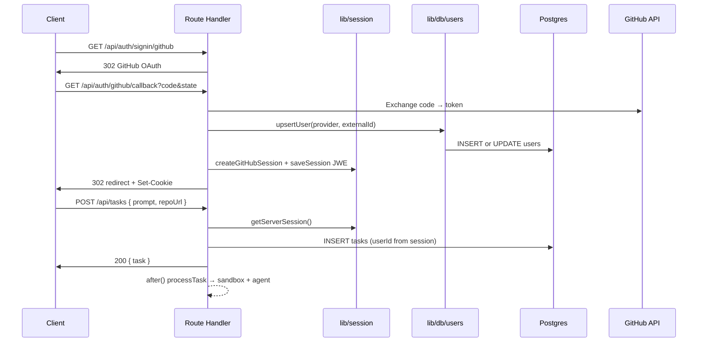

# Dokumen Desain Backend — ARES Auditor Web

| Field | Value |
|-------|-------|
| **Scope** | `apps/auditor-web` API surface (59 routes) |
| **Version** | 2026-08-04 |
| **Status** | Partially implemented — routes live; `/api/users/me`, `/api/usage/summary`, `/api/settings` planned; error taxonomy migration pending |
| **Related docs** | [rate-limiting-auditor-web.md](./rate-limiting-auditor-web.md) · [auth-auditor-web.md](./auth-auditor-web.md) · [database-auditor-web.md](./database-auditor-web.md) |

---

## Konteks Arsitektur Singkat

| Komponen | Lokasi | Peran |
|----------|--------|-------|
| Transport | `app/api/**/route.ts` | HTTP boundary, auth gate, serialisasi JSON |
| Application | `lib/db/*`, `lib/session/*`, `lib/github/*`, `lib/api-keys/*`, `lib/sandbox/*` | Orkestrasi use-case |
| Domain / persistence | `lib/db/schema.ts` + Drizzle | Entitas, constraint, Zod schema |
| Session | Cookie `_user_session_` (JWE) | Identitas user; **bukan** Supabase Auth dashboard |
| Supabase Auth | `lib/supabase/*` | **Terpisah** — knowledge-base OAuth; tidak memengaruhi API dashboard |

**Autentikasi saat ini:** tidak ada `middleware.ts`; setiap route handler memanggil `getServerSession()` / `getSessionFromReq()` secara eksplisit.

**Object-level auth:** semua query `tasks`, `task_messages`, `connectors`, `keys` wajib filter `userId = session.user.id` (soft-delete: `deletedAt IS NULL`).

**OAuth idempotent upsert:** `upsertUser()` di `lib/db/users.ts` — unique index `(provider, externalId)` pada tabel `users`; deduplikasi GitHub via `accounts.externalUserId`.

---

## 1. Peta Endpoint

Legenda permission:
- **Public** — tanpa session
- **Session** — cookie JWE valid
- **Session + GitHub** — session + token GitHub (connected atau primary)
- **Session + Vercel** — session + provider Vercel + token Vercel

Kolom **Idempotent:** ya/tidak/sebagian untuk write operation.

---

### 1.1 Auth (`/api/auth/*`)

| Method | Path | Summary | Permission | Idempotent |
|--------|------|---------|------------|------------|
| GET | `/api/auth/info` | Ambil & refresh session user (Vercel re-create; GitHub pass-through) | Session (optional) | Ya (read) |
| GET | `/api/auth/signin/github` | Redirect OAuth GitHub (sign-in atau connect flow) | Public | Tidak |
| POST | `/api/auth/signin/vercel` | Generate URL OAuth Vercel + PKCE cookies | Public | Tidak |
| GET | `/api/auth/callback/vercel` | Callback Vercel → buat session JWE | Public (state cookie) | Ya (upsert user) |
| GET | `/api/auth/github/callback` | Callback GitHub → sign-in atau connect account | Public (state cookie) | Ya (upsert/connect) |
| GET | `/api/auth/github/signin` | Alias/legacy sign-in GitHub | Public | Tidak |
| POST | `/api/auth/github/signin` | Variant POST sign-in GitHub | Public | Tidak |
| GET | `/api/auth/github/status` | Status koneksi GitHub user | Session | Ya |
| POST | `/api/auth/github/disconnect` | Putuskan GitHub linked (bukan primary) | Session (non-GitHub primary) | Ya |
| GET | `/api/auth/signout` | Revoke token + clear session cookie | Session (optional) | Ya |
| GET | `/api/auth/rate-limit` | Kuota harian pesan/task user | Session | Ya |

---

### 1.2 Users — **PLANNED** (`/api/users/*`)

| Method | Path | Summary | Permission | Idempotent |
|--------|------|---------|------------|------------|
| GET | `/api/users/me` | Profil user canonical: id, username, email, avatar, authProvider, githubConnected, createdAt | Session | Ya |

**Relasi existing:** `/api/auth/info` mengembalikan subset serupa (`SessionUserInfo`); `/api/users/me` adalah kontrak stabil untuk profile/settings/usage pages dan harus **menyatukan** data dari `users`, `accounts`, dan rate-limit metadata tanpa mengekspos token.

**Response shape (planned):**
```typescript
interface UserMeResponse {
  id: string
  username: string
  email: string | null
  name: string | null
  avatarUrl: string | null
  authProvider: 'github' | 'vercel'
  github: {
    connected: boolean
    username?: string
    connectedAt?: string // ISO8601
    isPrimary: boolean
  }
  createdAt: string
  lastLoginAt: string
}
```

---

### 1.3 Usage — **PLANNED** (`/api/usage/*`)

| Method | Path | Summary | Permission | Idempotent |
|--------|------|---------|------------|------------|
| GET | `/api/usage/summary` | Ringkasan plan, compute/on-demand usage, billing period | Session | Ya |

**Status saat ini:** UI `/usage` memakai `MOCK_USAGE_DATA` dari `lib/mock/usage.ts`.

**Response shape (planned, selaras mock):**
```typescript
interface UsageSummaryResponse {
  compute: { used: number; limit: number; unit: string }
  onDemand: { used: number; limit: number; unit: string }
  rateLimit: {
    used: number
    total: number
    remaining: number
    resetAt: string
  }
  plan: {
    id: string
    name: string
    priceLabel: string
    description: string
    features: string[]
  }
  billingPeriodEnd: string // ISO8601 date
}
```

**Sumber data fase 1:** agregasi internal (`tasks`, `task_messages`, `checkRateLimit`) + env/plan default. **Fase 2:** integrasi `packages/billing` / Stripe.

---

### 1.4 Settings — **PLANNED** (`/api/settings`)

| Method | Path | Summary | Permission | Idempotent |
|--------|------|---------|------------|------------|
| GET | `/api/settings` | Baca preferensi user (key-value dari `settings` table) | Session | Ya |
| PATCH | `/api/settings` | Update sebagian preferensi (upsert per key) | Session | Ya (per key) |

**Keys yang sudah dipakai domain layer:** `maxMessagesPerDay`, `maxSandboxDuration` (`lib/db/settings.ts`).  
**Keys planned UI:** `theme`, `emailNotifications`, `prUpdates` (client-only theme boleh tetap localStorage; server-side untuk sync cross-device).

---

### 1.5 Tasks (`/api/tasks/*`)

| Method | Path | Summary | Permission | Idempotent |
|--------|------|---------|------------|------------|
| GET | `/api/tasks` | List task user (exclude soft-deleted) | Session | Ya |
| POST | `/api/tasks` | Buat task + trigger processing async | Session | Sebagian (client `id`) |
| DELETE | `/api/tasks?action=completed,failed,stopped` | Bulk hard-delete by status | Session | Ya |
| GET | `/api/tasks/[taskId]` | Detail task (ownership check) | Session | Ya |
| PATCH | `/api/tasks/[taskId]` | Aksi `stop` | Session | Sebagian |
| DELETE | `/api/tasks/[taskId]` | Soft-delete (`deletedAt`) | Session | Ya |
| GET | `/api/tasks/[taskId]/messages` | List pesan task | Session | Ya |
| POST | `/api/tasks/[taskId]/continue` | Follow-up message + re-run agent | Session | Tidak |
| POST | `/api/tasks/[taskId]/pr` | Buat PR GitHub | Session + GitHub | Tidak |
| POST | `/api/tasks/[taskId]/merge-pr` | Merge PR | Session + GitHub | Tidak |
| POST | `/api/tasks/[taskId]/close-pr` | Tutup PR | Session + GitHub | Ya |
| POST | `/api/tasks/[taskId]/reopen-pr` | Buka kembali PR | Session + GitHub | Ya |
| POST | `/api/tasks/[taskId]/sync-pr` | Sync status PR dari GitHub | Session + GitHub | Ya |
| GET | `/api/tasks/[taskId]/check-runs` | CI check runs PR | Session + GitHub | Ya |
| GET | `/api/tasks/[taskId]/pr-comments` | Komentar PR | Session + GitHub | Ya |
| GET | `/api/tasks/[taskId]/files` | Tree file sandbox | Session | Ya |
| GET | `/api/tasks/[taskId]/file-content` | Konten file | Session | Ya |
| POST | `/api/tasks/[taskId]/save-file` | Tulis file ke sandbox | Session | Tidak |
| POST | `/api/tasks/[taskId]/create-file` | Buat file | Session | Tidak |
| DELETE | `/api/tasks/[taskId]/delete-file` | Hapus file | Session | Tidak |
| POST | `/api/tasks/[taskId]/create-folder` | Buat folder | Session | Tidak |
| POST | `/api/tasks/[taskId]/file-operation` | Copy/move file | Session | Tidak |
| POST | `/api/tasks/[taskId]/discard-file-changes` | Discard per-file | Session | Tidak |
| POST | `/api/tasks/[taskId]/reset-changes` | Reset git changes | Session | Tidak |
| POST | `/api/tasks/[taskId]/sync-changes` | Sync perubahan git | Session | Tidak |
| GET | `/api/tasks/[taskId]/diff` | Git diff | Session | Ya |
| POST | `/api/tasks/[taskId]/autocomplete` | AI autocomplete | Session | Tidak |
| POST | `/api/tasks/[taskId]/clear-logs` | Kosongkan logs task | Session | Ya |
| GET | `/api/tasks/[taskId]/sandbox-health` | Health sandbox Vercel | Session | Ya |
| POST | `/api/tasks/[taskId]/start-sandbox` | Start sandbox (keepAlive) | Session | Sebagian |
| POST | `/api/tasks/[taskId]/stop-sandbox` | Stop sandbox | Session | Ya |
| POST | `/api/tasks/[taskId]/restart-dev` | Restart dev server | Session | Tidak |
| POST | `/api/tasks/[taskId]/terminal` | Eksekusi perintah terminal | Session | Tidak |
| POST | `/api/tasks/[taskId]/lsp` | LSP request | Session | Tidak |
| GET | `/api/tasks/[taskId]/project-files` | File listing proyek | Session | Ya |
| GET | `/api/tasks/[taskId]/deployment` | Info deployment Vercel | Session | Ya |

**Pola ownership:** semua handler `[taskId]` query `WHERE id = taskId AND userId = session.user.id AND deletedAt IS NULL`. Task milik user lain → **404** (bukan 403), kecuali kontrak error baru mensyaratkan `FORBIDDEN` eksplisit untuk resource known-exists.

---

### 1.6 GitHub Proxy (`/api/github/*`)

| Method | Path | Summary | Permission | Idempotent |
|--------|------|---------|------------|------------|
| GET | `/api/github/user` | Profil GitHub authenticated | Session + GitHub | Ya |
| GET | `/api/github/repos?owner=` | List repo by owner/org | Session + GitHub | Ya |
| GET | `/api/github/user-repos` | Repo user (owned) | Session + GitHub | Ya |
| GET | `/api/github/orgs` | Organisasi user | Session + GitHub | Ya |
| GET | `/api/github/verify-repo?owner=&repo=` | Cek akses repo | Session + GitHub | Ya |
| POST | `/api/github/repos/create` | Buat repo GitHub | Session + GitHub | Tidak |

---

### 1.7 Repos Browser (`/api/repos/[owner]/[repo]/*`)

| Method | Path | Summary | Permission | Idempotent |
|--------|------|---------|------------|------------|
| GET | `/api/repos/[owner]/[repo]/commits` | Commits | Session + GitHub | Ya |
| GET | `/api/repos/[owner]/[repo]/issues` | Issues | Session + GitHub | Ya |
| GET | `/api/repos/[owner]/[repo]/pull-requests` | PR list | Session + GitHub | Ya |
| PATCH | `/api/repos/.../pull-requests/[pr_number]/close` | Tutup PR | Session + GitHub | Ya |
| GET | `/api/repos/.../pull-requests/[pr_number]/check-task` | Cek task terkait PR | Session | Ya |

---

### 1.8 API Keys (`/api/api-keys/*`)

| Method | Path | Summary | Permission | Idempotent |
|--------|------|---------|------------|------------|
| GET | `/api/api-keys` | List provider keys (tanpa nilai) | Session | Ya |
| POST | `/api/api-keys` | Upsert key terenkripsi | Session | Ya (userId+provider) |
| DELETE | `/api/api-keys?provider=` | Hapus key | Session | Ya |
| GET | `/api/api-keys/check?agent=&model=` | Cek ketersediaan key agent | Session/Public* | Ya |

*Saat ini tidak wajib session; hanya cek env/user key.

**Provider enum:** `anthropic | openai | cursor | gemini | aigateway`

---

### 1.9 Sandboxes (`/api/sandboxes`)

| Method | Path | Summary | Permission | Idempotent |
|--------|------|---------|------------|------------|
| GET | `/api/sandboxes` | Task dengan `sandboxId IS NOT NULL` milik user | Session | Ya |

---

### 1.10 Connectors (`/api/connectors`)

| Method | Path | Summary | Permission | Idempotent |
|--------|------|---------|------------|------------|
| GET | `/api/connectors` | List MCP connectors (decrypted server-side) | Session | Ya |

**Catatan:** Create/update/delete connectors saat ini via **Server Actions** (`lib/actions/connectors.ts`), bukan REST. Planned: REST `/api/connectors` POST/PATCH/DELETE untuk konsistensi API surface.

---

### 1.11 Vercel (`/api/vercel/*`)

| Method | Path | Summary | Permission | Idempotent |
|--------|------|---------|------------|------------|
| GET | `/api/vercel/teams` | Teams Vercel user | Session + Vercel | Ya |

---

### 1.12 Public

| Method | Path | Summary | Permission | Idempotent |
|--------|------|---------|------------|------------|
| GET | `/api/github-stars` | Star count repo monorepo | Public | Ya (cached 5m) |

---

## 2. Struktur Lapisan

```
┌─────────────────────────────────────────────────────────────┐
│  TRANSPORT (app/api/**/route.ts)                            │
│  - Parse request, status codes, NextResponse.json           │
│  - requireSession() / requireTaskOwnership() [planned]      │
└──────────────────────────┬──────────────────────────────────┘
                           │ calls
┌──────────────────────────▼──────────────────────────────────┐
│  APPLICATION (lib/*)                                          │
│  session/  auth gate, JWE, OAuth flows                      │
│  db/users  upsertUser, getUserById                            │
│  db/settings  getSetting, getMaxMessagesPerDay                │
│  github/   token resolution, Octokit helpers                  │
│  api-keys/ getUserApiKeys                                     │
│  sandbox/  creation, agents, git, registry                    │
│  utils/rate-limit  checkRateLimit                             │
└──────────────────────────┬──────────────────────────────────┘
                           │ reads/writes
┌──────────────────────────▼──────────────────────────────────┐
│  DOMAIN + PERSISTENCE (lib/db/schema.ts, Drizzle client)    │
│  users, accounts, tasks, task_messages, keys, connectors,     │
│  settings — Zod insert/select schemas                       │
└──────────────────────────┬──────────────────────────────────┘
                           │
┌──────────────────────────▼──────────────────────────────────┐
│  EXTERNAL SERVICES                                          │
│  Postgres · GitHub API · Vercel OAuth/Sandbox/Deploy API      │
└─────────────────────────────────────────────────────────────┘
```

**Arah dependency (wajib):**
- `app/api` → `lib/*` → `lib/db` → Postgres
- `app/api` **tidak** import langsung `@octokit/rest` atau `@vercel/sandbox` (kecuali legacy task routes — target refactor ke `lib/sandbox`)
- `lib/db/schema.ts` **tidak** import session/auth
- Client components **tidak** akses DB; hanya fetch API atau Server Components

**Planned shared helpers (`lib/api/`):**
```typescript
// lib/api/errors.ts — transport-level
// lib/api/require-session.ts
// lib/api/require-task.ts
```

---

## 3. Validasi

### 3.1 Input validation stack

| Layer | Mekanisme | Contoh |
|-------|-----------|--------|
| Schema DB | Drizzle + Postgres constraints | FK `tasks.userId`, unique `(provider, externalId)` |
| Domain | Zod schemas di `schema.ts` | `insertTaskSchema`, `insertKeySchema` |
| Route | Manual + Zod `.parse()` | `insertTaskSchema.parse(body)` di POST `/api/tasks` |
| OAuth | State cookie + CSRF | `github_auth_state`, `vercel_oauth_state` |

### 3.2 Validasi per domain

**Tasks (POST):**
- `prompt`: required, min 1 char
- `repoUrl`: optional, valid URL
- `selectedAgent`: enum `claude|codex|copilot|cursor|gemini|opencode`
- `maxDuration`: integer, capped by `getMaxSandboxDuration(userId)`
- `userId`: **server-derived** dari session, never trust client

**API Keys (POST):**
- `provider`: enum 5 values
- `apiKey`: non-empty string; encrypt sebelum persist

**Settings (PATCH planned):**
```typescript
const patchSettingsSchema = z.object({
  maxMessagesPerDay: z.number().int().min(1).max(1000).optional(),
  maxSandboxDuration: z.number().int().min(5).max(1440).optional(),
  theme: z.enum(['light', 'dark', 'system']).optional(),
  emailNotifications: z.boolean().optional(),
  prUpdates: z.boolean().optional(),
}).strict()
```

**GitHub OAuth callback:**
- Validasi `state` === cookie
- Connect flow: wajib `github_oauth_user_id` cookie

### 3.3 Sanitization khusus

- **Agent prompt:** strip backtick, `$`, `\`, prefix `-` di awal baris (anti CLI injection) — `processTask()`
- **Logs user-facing:** static strings only (`AGENTS.md`); no dynamic values in `logger.*`
- **Secrets:** encrypt at rest (`lib/crypto`); never return decrypted tokens/keys in API responses

---

## 4. Taksonomi Error

### 4.1 Kontrak response (target standar)

Saat ini mayoritas route mengembalikan `{ error: string }` ad-hoc. Kontrak desain mensyaratkan **machine-readable code**:

```typescript
type ApiErrorCode =
  | 'SESSION_REQUIRED'
  | 'FORBIDDEN'
  | 'NOT_FOUND'
  | 'VALIDATION_ERROR'
  | 'RATE_LIMIT_EXCEEDED'
  | 'GITHUB_NOT_CONNECTED'
  | 'OAUTH_STATE_INVALID'
  | 'CONFLICT'
  | 'INTERNAL_ERROR'

interface ApiErrorResponse {
  error: {
    code: ApiErrorCode
    message: string          // human-readable, generic (no secrets)
    details?: Record<string, string[]>  // field errors
    meta?: Record<string, unknown>    // e.g. rate limit resetAt
  }
}
```

### 4.2 Mapping HTTP status

| Code | HTTP | Kapan |
|------|------|-------|
| `SESSION_REQUIRED` | 401 | Tidak ada / invalid JWE session |
| `FORBIDDEN` | 403 | Session valid tapi aksi dilarang (e.g. disconnect primary GitHub, task bukan milik user jika policy 403) |
| `NOT_FOUND` | 404 | Resource tidak ada **atau** tidak visible (ownership masking) |
| `VALIDATION_ERROR` | 400 | Zod/body/query invalid |
| `RATE_LIMIT_EXCEEDED` | 429 | `checkRateLimit` false |
| `GITHUB_NOT_CONNECTED` | 401 atau 422 | Token GitHub tidak tersedia |
| `OAUTH_STATE_INVALID` | 400 | State mismatch OAuth |
| `CONFLICT` | 409 | Duplicate resource, PR already exists |
| `INTERNAL_ERROR` | 500 | Unhandled exception |

### 4.3 Migrasi dari existing

| Existing message | Target code |
|------------------|-------------|
| `{ error: 'Unauthorized' }` | `SESSION_REQUIRED` |
| `{ error: 'Task not found' }` (wrong owner) | `NOT_FOUND` (keep 404) |
| `{ error: 'Cannot disconnect primary...' }` | `FORBIDDEN` |
| `{ error: 'Rate limit exceeded', ... }` | `RATE_LIMIT_EXCEEDED` + meta |
| `{ error: 'GitHub not connected' }` | `GITHUB_NOT_CONNECTED` |
| `'Invalid OAuth state'` (plain text 400) | `OAUTH_STATE_INVALID` |

**Helper planned:**
```typescript
function apiError(code: ApiErrorCode, message: string, status: number, meta?: object): NextResponse
```

---

## 5. Idempotensi (per write operation)

| Operation | Key idempotensi | Perilaku |
|-----------|-----------------|----------|
| OAuth sign-in (GitHub/Vercel) | `(provider, externalId)` | `upsertUser()` update token/profile; tidak duplikasi row |
| GitHub connect | `(userId, provider='github')` unique on `accounts` | Upsert token; merge account jika externalId sudah ter-link ke user lain |
| POST `/api/api-keys` | `(userId, provider)` | Upsert encrypted value |
| PATCH `/api/settings` | `(userId, key)` | Upsert di `settings` table |
| POST `/api/tasks` | Optional client `body.id` | Jika ID sama + retry → constraint PK conflict; **planned:** return 200 existing task |
| POST `/api/tasks/[id]/continue` | Tidak idempotent | Setiap call = new user message + agent run |
| POST `/api/tasks/[id]/pr` | `(repo, head branch)` | GitHub 422 jika PR exists; return conflict code |
| PATCH stop task | `status=stopped` | Second stop → 400 (already stopped) |
| DELETE soft task | `deletedAt` set | Second delete → 404 |
| DELETE bulk tasks | status filter | Re-run safe; second call deletes 0 |
| GitHub signout | Revoke + clear cookie | Safe to repeat |

**OAuth connect merge (existing):** jika GitHub `externalUserId` sudah di `accounts` untuk user B, connect dari user A memindahkan tasks/connectors/accounts/keys ke A dan menghapus user B — operasi multi-table **harus** dibungkus transaction (lihat §6).

---

## 6. Batas Transaksi

### 6.1 Prinsip

Postgres via Drizzle; **tidak** semua flow memakai explicit transaction hari ini — ini technical debt.

### 6.2 Operasi yang WAJIB atomic

| Flow | Tables | Rekomendasi |
|------|--------|-------------|
| GitHub connect + account merge | `tasks`, `connectors`, `accounts`, `keys`, `users` | `db.transaction()` |
| Task create + initial message | `tasks`, `task_messages` | Single transaction atau message insert inside `processTask` (acceptable eventual) |
| Settings PATCH multi-key | `settings` | Single transaction |
| API key upsert | `keys` | Single statement upsert (already safe) |

### 6.3 Operasi NON-transactional (by design)

| Flow | Alasan |
|------|--------|
| Task processing (`after()`) | Long-running; sandbox + agent di luar DB |
| AI title/branch generation | Best-effort background update |
| GitHub API calls | External; compensate with retry/status sync |
| Sandbox lifecycle | Vercel API; DB update sandboxId terpisah |

### 6.4 Isolation & failure

- **OAuth callback failure mid-merge:** rollback transaction; user tetap session lama
- **Task POST success + processing fail:** task row tetap; status → `error` via logger
- **Rate limit check:** read-only count; race condition acceptabel (±1 message over limit)

---

## 7. Paginasi dan Penyaringan

### 7.1 Existing behavior

| Endpoint | Paginasi | Filter |
|----------|----------|--------|
| GET `/api/tasks` | **Tidak** — return all | Implicit: `userId`, `deletedAt IS NULL`, order `createdAt DESC` |
| GET `/api/tasks/[id]/messages` | Tidak | `taskId` |
| GET `/api/github/repos` | Internal loop GitHub API (100/page) | `owner` query param |
| GET `/api/sandboxes` | Tidak | `sandboxId IS NOT NULL`, `userId` |
| DELETE `/api/tasks` | N/A | `?action=completed,failed,stopped` |

### 7.2 Planned standard (cursor-based)

```typescript
interface PaginationParams {
  cursor?: string   // opaque: base64(createdAt:id)
  limit?: number    // default 20, max 100
}

interface PaginatedResponse<T> {
  data: T[]
  nextCursor: string | null
  hasMore: boolean
}
```

**Prioritas implementasi:**
1. GET `/api/tasks` — cursor on `(createdAt, id)`
2. GET `/api/tasks/[id]/messages` — cursor on `createdAt`
3. GET `/api/repos/.../commits|issues|pull-requests` — pass-through GitHub pagination (`page`, `per_page`)

### 7.3 Filtering planned

GET `/api/tasks?status=processing&agent=claude&repo=owner/repo`

---

## 8. Pekerjaan Latar Belakang

### 8.1 Mekanisme runtime

Next.js **`after()`** — keeps serverless function alive setelah response (critical untuk task processing).

### 8.2 Job inventory

| Job | Trigger | Durasi | Failure handling |
|-----|---------|--------|------------------|
| `processTaskWithTimeout` | POST `/api/tasks` | ≤ `maxDuration` minutes | status → `error`, sandbox shutdown |
| AI branch name | POST `/api/tasks` (after) | ~seconds | fallback branch name |
| AI title | POST `/api/tasks` (after) | ~seconds | fallback truncated prompt |
| Follow-up agent | POST `.../continue` | ≤ maxDuration | same as processTask |
| Sandbox start (keepAlive) | POST `.../start-sandbox` | minutes | 400/500 to client |
| PR sync | POST `.../sync-pr` | seconds | log error, manual retry |

### 8.3 Planned (belum ada)

| Job | Deskripsi |
|-----|-----------|
| Usage aggregation cron | Hitung compute hours dari sandbox duration logs → feed `/api/usage/summary` |
| Stale sandbox cleanup | Scan `tasks` dengan sandboxId lama → shutdown + clear |
| OAuth token refresh | Vercel refresh token rotation |
| Webhook GitHub | PR status push → update `tasks.prStatus` |

### 8.4 Queue architecture (future)

Untuk skala enterprise: Arq worker di `apps/auditor-api` atau Vercel Workflow; auditor-web enqueue via HTTP internal. **Out of scope MVP** tapi boundary sudah jelas di `after()` sebagai interim.

---

## 9. Versioning

### 9.1 API versioning (current)

**Tidak ada prefix versi.** Semua route `/api/...` implisit **v1**.

### 9.2 Strategi planned

| Fase | Approach |
|------|----------|
| MVP | Unversioned; breaking changes via feature flags |
| P2 | Header `Accept: application/vnd.ares.v1+json` |
| P3 | Path prefix `/api/v2/` untuk kontrak baru (usage billing, settings) |

### 9.3 Backward compatibility rules

- **`/api/auth/info`** tetap supported saat `/api/users/me` lands; deprecate info setelah 2 release
- Error shape: support dual `{ error: string }` + `{ error: { code } }` selama migrasi client
- Session cookie format: bump JWE `typ` jika payload berubah; maintain decrypt fallback 1 release

### 9.4 Schema migration

Drizzle migrations di `apps/auditor-web/drizzle/`; `settings`, `users`, `tasks` changes require migration + rollback plan. Unique indexes (`users_provider_external_id_idx`) **tidak** di-drop tanpa data migration.

---

## Diagram Alur Auth + Task (referensi)



---

## Self-Check Checklist

### Kontrak desain
- [x] `GET /api/users/me` didokumentasi (planned) dengan shape lengkap
- [x] `GET /api/usage/summary` didokumentasi (planned); existing mock diidentifikasi
- [x] `PATCH settings` didokumentasi (planned); existing `settings` table + `lib/db/settings.ts` direferensi
- [x] Existing `/api/auth/*`, `/api/tasks/*`, `/api/github/*` dipetakan
- [x] Object-level auth `userId` filter dijelaskan
- [x] Idempotent OAuth upsert `(provider, externalId)` dijelaskan
- [x] Error codes `SESSION_REQUIRED`, `FORBIDDEN`, dll. didefinisikan + mapping migrasi

### Akurasi codebase
- [x] 59 route handlers di `app/api/**/route.ts` tercakup (grouped)
- [x] `lib/db/schema.ts` — 7 entitas utama (users, accounts, tasks, task_messages, keys, connectors, settings)
- [x] `lib/db/users.ts` (bukan `lib/users.ts`) sebagai user domain service
- [x] `lib/session/*` — JWE cookie, bukan Supabase session dashboard
- [x] `lib/github/*` — token resolution + Octokit helpers
- [x] Tidak ada implementasi code feature (hanya type shapes)

### Gap / action items engineering
- [ ] Standardisasi `ApiErrorResponse` di semua routes (migrasi bertahap)
- [ ] Implement `GET /api/users/me`, `GET /api/usage/summary`, `GET|PATCH /api/settings`
- [ ] Wrap GitHub account merge dalam `db.transaction()`
- [ ] Paginasi GET `/api/tasks`
- [ ] Extract `requireSession()` / `requireTaskOwnership()` shared middleware helper
- [ ] REST CRUD `/api/connectors` (opsional; saat ini Server Actions)

---

*Dokumen ini selaras dengan state repo per audit file `apps/auditor-web` — kontrak planned tidak mengubah implementasi existing tanpa review product.*

[REDACTED]