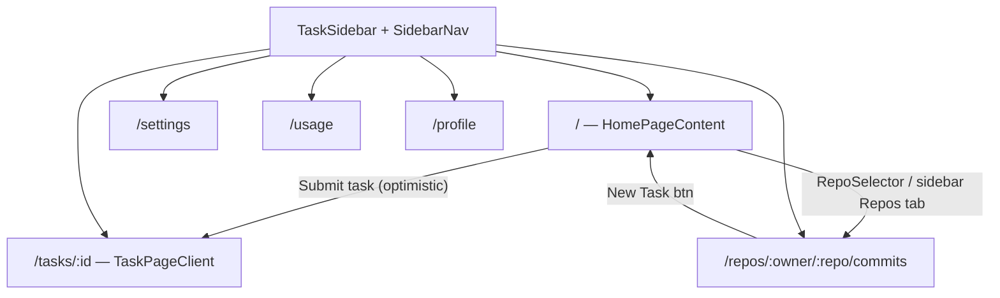
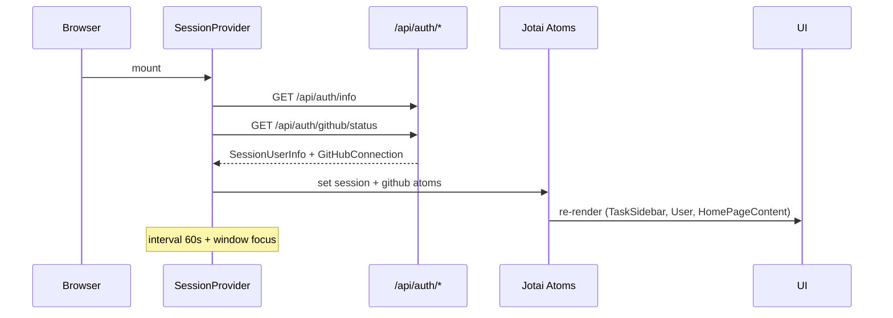

# Dokumen Desain Frontend Engineer — ARES Auditor Web

| Field | Value |
|-------|-------|
| **Scope** | `apps/auditor-web` UI (Next.js 16 App Router) |
| **Version** | 2026-08-04 |
| **Status** | Partially implemented — `/settings`, `/usage`, `/profile` + sidebar + Progress component live; real usage API pending |
| **Related docs** | [caching-auditor-web.md](./caching-auditor-web.md) · [backend-auditor-web.md](./backend-auditor-web.md) |

---

## 1. Peta Layar dan Rute

### 1.1 Arsitektur shell global

Semua halaman dibungkus oleh **root layout** (`app/layout.tsx`):

```
html (lang="en")
└── body
    └── JotaiProvider
        └── ThemeProvider (class, defaultTheme="system")
            ├── SessionProvider          ← fetch client-side session + GitHub status
            ├── AppLayoutWrapper         ← SSR cookie sidebar prefs + UA mobile detect
            │   └── AppLayout
            │       ├── TaskSidebar      ← sidebar persisten (Tasks / Repos tabs)
            │       └── {children}       ← konten halaman
            └── Toaster (sonner)
```

**Catatan v1 auth:** Dashboard menggunakan **GitHub OAuth** dan/atau **Vercel OAuth** via cookie session JWE. **Tidak ada Supabase UI auth** di dashboard v1. File Supabase (`lib/supabase/*`, `auth/callback`, `auth/auth-code-error`) ada sebagai scaffolding/future work, bukan jalur sign-in utama.

### 1.2 Peta rute (user-facing)

| Rute | Tipe | Server/Client | Deskripsi |
|------|------|---------------|-----------|
| `/` | Page (RSC) | `page.tsx` → `HomePageContent` | Landing + form buat task audit baru |
| `/tasks` | Page (RSC) | Redirect jika belum login → `/` | Daftar task (authenticated only) |
| `/tasks/[taskId]` | Page (RSC) | `TaskPageClient` + `loading.tsx` + `not-found.tsx` | Detail task: logs, file browser, chat, sandbox |
| `/new/[owner]/[repo]` | Page (RSC) | Pre-fill repo → home flow | Shortcut buat task dari repo |
| `/[owner]/[repo]` | Page (RSC) | Alias legacy new-task | Sama intent dengan `/new/...` |
| `/repos/new` | Page | Buat repo GitHub baru | Post-create redirect + localStorage hint |
| `/repos/[owner]/[repo]` | Page | Redirect → `/commits` | Root repo |
| `/repos/[owner]/[repo]/commits` | Page | `RepoLayout` + `RepoCommits` | Tab commits |
| `/repos/[owner]/[repo]/issues` | Page | `RepoLayout` + `RepoIssues` | Tab issues |
| `/repos/[owner]/[repo]/pull-requests` | Page | `RepoLayout` + `RepoPullRequests` | Tab PR |
| `/settings` | Page (RSC) | `SettingsPageClient` | Preferensi workspace, theme, notifikasi (stub) |
| `/usage` | Page (RSC) | `UsagePageClient` | Plan & usage (mock data v1) |
| `/profile` | Page (RSC) | `ProfilePageClient` | Profil user + connected services |
| `/auth/auth-code-error` | Page (static) | Error OAuth Supabase | Fallback error page |
| `/auth/callback` | Route handler | Supabase callback | Bukan UI dashboard |

### 1.3 Navigasi sidebar bawah

`SidebarNav` menampilkan link persisten di footer sidebar:

| Link | Akses | Kondisi |
|------|-------|---------|
| `/settings` | Publik | Selalu visible |
| `/usage` | Publik | Selalu visible |
| `/profile` | Signed-in only | Hidden jika `!session.user` |

Active state: `pathname === href || pathname.startsWith(href + '/')`.

### 1.4 Diagram alur navigasi utama



### 1.5 Layout per zona layar

| Zona | Komponen | Perilaku |
|------|----------|----------|
| **Sidebar kiri** | `TaskSidebar` | Fixed width 200–600px (default 288px), resizable desktop, overlay mobile |
| **Header atas** | `SharedHeader` | Menu toggle, `AresBrand`, slot `leftActions`, GitHub stars, `User` |
| **Konten utama** | `children` / `*PageClient` | Scroll independen, `max-w-3xl` untuk halaman account |

---

## 2. Batas Komponen (Container vs Presentational)

### 2.1 Prinsip pemisahan

| Lapisan | Tanggung jawab | Contoh |
|---------|-----------------|--------|
| **RSC Page** (`app/**/page.tsx`) | SSR session, cookies, metadata, redirect | `getServerSession()`, baca cookie prefs |
| **Client Container** (`*-page-client.tsx`, `app-layout.tsx`, `home-page-content.tsx`) | State, fetch client, routing, orchestration | `HomePageContent`, `TaskPageClient` |
| **Feature Components** | UI domain-specific, bisa punya state lokal | `TaskForm`, `TaskSidebar`, `FileBrowser`, `LogsPane` |
| **Presentational / UI** | Tanpa business logic | `components/ui/*`, `logos/*`, `icons/*` |
| **Providers** | Context/atom bootstrap | `SessionProvider`, `ConnectorsProvider`, `ThemeProvider` |

### 2.2 Peta komponen kunci

```
app/layout.tsx
├── SessionProvider              [container — bootstrap atoms]
├── AppLayoutWrapper             [RSC — cookie/UA]
└── AppLayout                    [container — tasks list, sidebar state]
    ├── TaskSidebar              [container — tabs, fetch repos, delete]
    └── children
        ├── HomePageContent      [container — auth gating, submit, repo selection]
        │   ├── SharedHeader     [presentational + useTasks hook]
        │   ├── RepoSelector     [container — GitHub API]
        │   └── TaskForm         [container — agent/model prefs, validation]
        ├── TaskPageClient       [container — useTask polling]
        │   ├── TaskDetails      [feature]
        │   ├── LogsPane         [feature]
        │   └── TaskActions      [feature]
        ├── SettingsPageClient   [mostly presentational v1]
        ├── UsagePageClient      [presentational + mock data]
        └── ProfilePageClient    [presentational + atom read]
```

### 2.3 Kontrak props server → client

Pola konsisten di semua halaman account/task:

```typescript
// Server page passes:
{
  user: Session['user'] | null,        // dari getServerSession()
  authProvider?: 'github' | 'vercel',  // profile/task pages
  initialStars?: number,               // SSR GitHub stars count
  maxSandboxDuration?: number,         // task/home pages
}
```

Client kemudian **menyinkronkan** dengan `sessionAtom` via `SessionProvider` + `User` component (hydration-safe fallback ke props server).

### 2.4 SharedHeader sebagai composition root

`SharedHeader` menerima:
- `leftActions?: ReactNode` — repo selector (home), repo title (task/repo pages)
- `extraActions?: ReactNode` — slot ekstensi
- `initialStars`, `hideStars`

Selalu memanggil `useTasks().toggleSidebar` — **hanya valid di dalam `AppLayout`**.

### 2.5 Komponen auth

| Komponen | Peran |
|----------|-------|
| `SessionProvider` | Fetch `/api/auth/info` + `/api/auth/github/status`, refresh 60s + on focus |
| `SignIn` | Dialog OAuth (GitHub/Vercel) berdasarkan `NEXT_PUBLIC_AUTH_PROVIDERS` |
| `SignOut` / `User` | Avatar dropdown, API keys dialog, disconnect |
| `redirectToSignIn()` | Vercel OAuth redirect helper |

**Tidak** ada komponen Supabase `<Auth />` di dashboard v1.

---

## 3. Strategi State

### 3.1 Tabel kepemilikan state

| State | Owner | Persistensi | Scope | Catatan |
|-------|-------|-------------|-------|---------|
| Session user + authProvider | `sessionAtom` | Memory (refetch) | Global | Diisi `SessionProvider` dari `/api/auth/info` |
| Session initialized flag | `sessionInitializedAtom` | Memory | Global | Gate UI auth-dependent |
| GitHub connection | `githubConnectionAtom` | Memory (refetch) | Global | `{ connected, username?, connectedAt? }` |
| GitHub connection initialized | `githubConnectionInitializedAtom` | Memory | Global | Gate repo UI |
| Task list | `AppLayout` useState | Memory + poll 5s | Global shell | `/api/tasks`, 401 → empty |
| Sidebar open/width | `AppLayout` useState | Cookie | Global shell | `sidebar-open`, `sidebar-width` |
| Task prompt draft | `taskPromptAtom` | localStorage | Global | Key: `task-prompt` |
| Per-task chat input | `taskChatInputAtomFamily(taskId)` | localStorage | Per task | Key: `task-chat-input-{id}` |
| Last agent/model | `lastSelectedAgentAtom`, `lastSelectedModelAtomFamily` | localStorage | Global/per agent | Agent prefs |
| Multi-repo mode | `multiRepoModeAtom` | Memory | Home | Toggle compare mode |
| Selected repos (multi) | `selectedReposAtom` | Memory | Home | Array `SelectedRepo` |
| GitHub repos cache | `githubReposAtomFamily(owner)` | Memory | Per owner | Reduce API calls |
| File browser state | `fileBrowserStateFamily` | Memory | Per task | local/remote/all view modes |
| Connector dialog | `connectorDialogAtom` | Memory | Global | MCP management |
| Newly created repo hint | localStorage `newly-created-repo` | localStorage | One-shot | Consumed on home mount |
| GitHub owners/repos cache | localStorage `github-owners`, `github-repos-*` | localStorage | Client cache | Cleared on disconnect/refresh |
| Selected owner/repo | Cookie + component state | Cookie | Home/header | `selected-owner`, `selected-repo` |
| Task form prefs | Cookie + component state | Cookie | TaskForm | install-deps, max-duration, keep-alive, enable-browser |
| Pane visibility/heights | Cookie | Cookie | Task detail | files/code/preview/chat/logs panes |
| Theme | next-themes | localStorage (class on html) | Global | light/dark/system |
| Single task detail | `useTask` hook | Memory + poll 5s | Per page | Retry 3× on 404 (race create) |
| URL query `owner`, `repo` | Next.js searchParams | URL | Home | Deep link repo selection |
| URL `github_connected` | searchParams | URL (one-shot) | Home | Toast + strip param |

### 3.2 Aturan sinkronisasi

1. **Server session (RSC)** = snapshot awal; **client atom** = source of truth setelah hydrate.
2. **Cookie prefs** dibaca di RSC (`page.tsx`) dan ditulis di client (`TaskForm`, `RepoLayout`).
3. **Optimistic UI** untuk task creation: `addTaskOptimistically()` → navigate → POST `/api/tasks`.
4. **Polling**, bukan WebSocket (v1): tasks 5s, single task 5s, session 60s.

### 3.3 Diagram alur state auth



---

## 4. Pengambilan Data

### 4.1 Pola fetch per domain

| Domain | Metode | Endpoint | Trigger | Auth |
|--------|--------|----------|---------|------|
| Session | Client fetch | `GET /api/auth/info` | Mount, 60s, focus | Cookie |
| GitHub status | Client fetch | `GET /api/auth/github/status` | Mount, 60s, focus | Cookie |
| Task list | Client fetch | `GET /api/tasks` | AppLayout mount, 5s poll | Cookie (401 → []) |
| Single task | Client hook | `GET /api/tasks/[id]` | Mount, retry, 5s poll | Cookie |
| Create task | Client POST | `POST /api/tasks` | Form submit | Cookie required |
| GitHub repos (sidebar) | Client fetch | `GET /api/github/user-repos` | Repos tab, infinite scroll | Cookie + GitHub connected |
| GitHub repos (selector) | Client fetch | `GET /api/github/repos`, `/api/github/orgs` | Owner change | Cookie |
| GitHub stars (header) | SSR | `getGitHubStars()` | Page load | Public cache |
| Max sandbox duration | SSR | `getMaxSandboxDuration(userId)` | Page load | Server DB |
| Repo commits/issues/PRs | Client fetch | `GET /api/repos/[owner]/[repo]/*` | Tab mount | Cookie |
| Connectors/MCP | Context | `GET /api/connectors` | ConnectorsProvider | Cookie |
| API keys | Dialog fetch | `GET /api/api-keys` | User menu | Cookie |
| Usage/plan | **Mock v1** | `MOCK_USAGE_DATA` | Static import | Future: billing API |

### 4.2 Server Components yang fetch

```typescript
// Pola standar di page.tsx:
const session = await getServerSession()          // JWE cookie → DB user
const stars = await getGitHubStars()              // cached external
const maxSandboxDuration = await getMaxSandboxDuration(session?.user?.id)
// Cookie prefs untuk form defaults
const cookieStore = await cookies()
```

### 4.3 Error handling fetch

| Status | Perilaku UI |
|--------|-------------|
| 401 | Tasks kosong; submit → sign-in dialog |
| 404 (task) | Retry 3× (2s interval), lalu error state |
| Network error | Console server-side; toast generic ke user |
| GitHub not connected | Sidebar repos empty; header "Connect GitHub" |

### 4.4 Roadmap integrasi data (planned)

| Halaman | Saat ini | Target |
|---------|----------|--------|
| `/usage` | `lib/mock/usage.ts` | `GET /api/billing/usage` |
| `/settings` notifications | Switch disabled | Alerts service |
| `/profile` | Read-only | Edit profile (future) |

---

## 5. Keadaan Antarmuka (per Main Screen)

### 5.1 Home (`/`)

| State | UI | Aksi user |
|-------|-----|-----------|
| **Loading (session)** | Repo header hidden sampai `githubConnectionInitialized` | — |
| **Guest** | Form visible; repo selector optional; sidebar "Sign in to view tasks" | Submit → Sign-in dialog |
| **Signed in, no GitHub** | "Connect GitHub" di header | OAuth connect flow |
| **Signed in + GitHub** | Full RepoSelector + dropdown actions | Submit task |
| **Submitting** | `TaskForm` disabled, spinner | — |
| **Multi-repo empty** | Toast error "Please select repositories" | Open MultiRepoDialog |
| **No repo selected** | Toast error "Please select a repository" | Pick from header |
| **Success** | Optimistic sidebar + navigate `/tasks/:id` | — |
| **Error POST** | Toast dengan message API | Retry submit |

### 5.2 Task Detail (`/tasks/[taskId]`)

| State | UI | File terkait |
|-------|-----|--------------|
| **Route loading** | `loading.tsx` — spinner + SharedHeader | App Router suspense |
| **Hook loading** | Header only (minimal) | `useTask` initial |
| **Not found** | Inline error + `not-found.tsx` fallback | 404 setelah 3 retry |
| **Running** | LogsPane streaming, progress indicators | Poll 5s |
| **Completed/Failed/Stopped** | Status badges, PR icons di sidebar | TaskSidebar cards |
| **Sandbox pending** | Refetch on log "Development server is running" | `useTask` effect |
| **Forbidden** | Same as not found (API 404, bukan 403 explicit) | — |

### 5.3 Task Sidebar (global)

| State | Tasks tab | Repos tab |
|-------|-----------|-----------|
| **Logged out** | Empty card "Sign in to view and create tasks" | Empty card "Sign in to view repositories" |
| **Logged in, loading** | `SidebarLoader` skeleton | — |
| **Logged in, empty tasks** | Empty state message | — |
| **Logged in, repos loading** | Task cards | Spinner infinite scroll |
| **Logged in, no repos** | — | "No repositories found" |
| **Search no match** | — | "No repos match ..." |
| **Active task** | Ring highlight + agent logo + PR status | — |

### 5.4 Repo Pages (`/repos/[owner]/[repo]/*`)

| State | UI |
|-------|-----|
| **Loading** | Skeleton/spinner di tab content |
| **Empty** | Empty state per tab (commits/issues/PRs) |
| **Error API** | Error message inline |
| **Success** | Table/list dengan link eksternal GitHub |

Header: `{owner}/{repo}` + tab nav (`aria-label="Repository navigation"`) + "New Task" → set cookies + `/`.

### 5.5 Settings (`/settings`)

| State | UI |
|-------|-----|
| **Guest** | Theme works; Account card prompts sign-in via header |
| **Signed in** | Full cards: Appearance, Notifications (disabled switches), API & Security |
| **Future** | Enable switches when alerts service connected |

### 5.6 Usage (`/usage`)

| State | UI |
|-------|-----|
| **Guest** | Banner info + mock data tetap ditampilkan |
| **Signed in** | Same mock data (labeled "Mock usage data") |
| **Plan actions** | Toast info "billing not connected" |

### 5.7 Profile (`/profile`)

| State | UI |
|-------|-----|
| **Guest** | Card "Sign in required" + `<SignIn />` |
| **Signed in** | Avatar, username, email, auth provider badge |
| **GitHub connected** | Green "Connected" badge |
| **GitHub not connected** | "Not connected" + hint link from account menu |

### 5.8 Auth flows

| Flow | Entry | Success | Error |
|------|-------|---------|-------|
| GitHub sign-in | `SignIn` dialog / `startGitHubOAuth()` | Session atom update | Toast / redirect |
| Vercel sign-in | `redirectToSignIn()` | OAuth callback | — |
| GitHub connect (existing user) | Header "Connect GitHub" | `?github_connected=true` toast | — |
| Disconnect GitHub | Header dropdown | Clear localStorage cache | Toast error |
| Sign out | `SignOut` | `/api/auth/signout` | — |

---

## 6. Form dan Validasi

### 6.1 TaskForm (`/`)

| Field | Validasi client | Default source |
|-------|-----------------|----------------|
| `prompt` | HTML `required`; non-empty sebelum submit | `taskPromptAtom` (localStorage) |
| `selectedAgent` | Must be valid agent or `multi-agent` | `lastSelectedAgentAtom` |
| `selectedModel` | Required unless multi-agent | `lastSelectedModelAtomFamily(agent)` |
| `selectedModels[]` | Min 1 jika multi-agent | — |
| `repoUrl` | Validated di `HomePageContent` (bukan TaskForm) | Cookie owner/repo → constructed URL |
| `installDependencies` | Boolean | Cookie |
| `maxDuration` | Number, capped by `maxSandboxDuration` | Cookie / server |
| `keepAlive` | Boolean | Cookie |
| `enableBrowser` | Boolean | Cookie |
| API keys | Pre-submit check per agent (`AGENT_API_KEY_REQUIREMENTS`) | `/api/api-keys/check` |

**Keyboard:** Enter di textarea (tanpa Shift) → submit form.

**Pre-submit gates (HomePageContent):**
1. User authenticated
2. Repo selected (single mode) OR repos selected (multi mode)
3. API keys present for selected agent (toast jika missing)

### 6.2 RepoSelector

- Owner required before repo list loads
- Cache invalidation via "Refresh Owners/Repos" → clear localStorage + reload

### 6.3 Settings forms (v1)

- Theme: immediate apply via `ThemeSelector` (no submit)
- Notification switches: **disabled** — no validation needed yet

### 6.4 Delete Tasks dialog (sidebar)

- Min 1 checkbox (completed/failed/stopped) required
- Confirm → bulk DELETE API
- Button disabled saat `isDeleting`

### 6.5 Validasi server-side (kontrak API)

Frontend mengandalkan response API untuk:
- 401 unauthorized
- 400 validation errors → toast `error.message`
- Rate limit (`/api/auth/rate-limit`) — handled server-side

**Tidak ada Zod schema di client v1** — validasi imperative + HTML5.

---

## 7. Aksesibilitas

### 7.1 Foundation

| Area | Implementasi saat ini | Target |
|------|----------------------|--------|
| Language | `html lang="en"` | Pertahankan; konten EN |
| Focus ring | shadcn `outline-ring/50`, `focus-visible:ring-2` on brand link | Konsisten di custom buttons |
| Semantic nav | `SidebarNav` → `<nav>`, RepoLayout → `aria-label="Repository navigation"` | Tambah `aria-current="page"` pada active links |
| Icon buttons | `title` attribute (Menu, New Task, etc.) | Tambah `aria-label` eksplisit |
| Dialogs | Radix Dialog/AlertDialog (focus trap built-in) | — |
| Form labels | `Label` + `htmlFor` di settings switches | Extend ke TaskForm agent selects |
| Color contrast | OKLCH tokens, dark default | Verify WCAG AA on `muted-foreground` |
| Keyboard | `Cmd/Ctrl+B` toggle sidebar | Document in settings/help |
| Motion | `disableTransitionOnChange` on ThemeProvider | Respect `prefers-reduced-motion` (future) |
| Live regions | LogsPane updates | `aria-live="polite"` for new log lines (future) |

### 7.2 Mobile a11y

- Sidebar: overlay backdrop, close on link click (`handleLinkClick`)
- Git diff viewer: horizontal scroll + reduced font (`globals.css` @768px)
- Touch targets: buttons min `h-8 w-8` (32px) — borderline; prefer 44px for primary actions

### 7.3 Auth a11y

- Sign-in dialog: descriptive `DialogDescription` varies by provider config
- Loading states: spinner + "Loading..." text (not icon-only)

---

## 8. Anggaran Performa

### 8.1 Bundle & rendering

| Strategi | Detail |
|----------|--------|
| RSC defaults | Pages fetch session server-side; minimize client JS on static account pages |
| `'use client'` boundary | Hanya di interactive shells (`AppLayout`, `*PageClient`, forms) |
| Dynamic import candidates | `Monaco Editor`, `FileDiffViewer`, `Terminal` — lazy load on task page tab open |
| Font | Geist Sans/Mono via `next/font` (self-hosted, no layout shift) |
| Analytics | Vercel Analytics + Speed Insights (root layout) |

### 8.2 Runtime budgets (target)

| Metrik | Target | Catatan |
|--------|--------|---------|
| LCP (home) | < 2.5s | SSR stars + session; defer GitHub repo fetch |
| INP | < 200ms | Sidebar resize throttled via mousemove |
| CLS | < 0.1 | ThemeSelector skeleton until mounted |
| Task page TTI | < 4s | Monaco is heavy — load on demand |

### 8.3 Network & polling

| Resource | Interval | Optimisasi rencana |
|----------|----------|-------------------|
| `/api/tasks` | 5s global | Pause when tab hidden (`document.visibilityState`) |
| `/api/tasks/[id]` | 5s | Stop poll when task terminal state |
| Session refresh | 60s | OK |
| GitHub repos sidebar | Infinite scroll | Debounce search 300ms ✓ |

### 8.4 Caching

- GitHub stars: server function with cache
- GitHub owners/repos: localStorage client cache (manual invalidation)
- No React Query/SWR v1 — manual fetch + useState

### 8.5 Image & assets

- `AresLogo`: SVG/React component (no raster LCP)
- User avatars: GitHub CDN with `&s=144` resize param

---

## 9. Sistem Visual (Tokens)

### 9.1 Design system stack

| Layer | Config |
|-------|--------|
| Component library | shadcn/ui **new-york** style |
| Config file | `components.json` — `baseColor: neutral`, `cssVariables: true` |
| CSS engine | Tailwind v4 (`@import 'tailwindcss'`) |
| Icons | Lucide React (shadcn default) + custom agent logos |
| Animation | `tw-animate-css`, custom `@keyframes shimmer` |
| Markdown stream | `@source "../node_modules/streamdown/dist/*.js"` |

### 9.2 Typography

| Token | Value |
|-------|-------|
| `--font-geist-sans` | Body UI (`font-sans`) |
| `--font-geist-mono` | Code/logs/terminal (`font-mono`) |
| Page title | `text-2xl font-semibold tracking-tight` |
| Section title | `text-lg font-medium` / CardTitle `text-base` |
| Sidebar items | `text-xs font-medium` |
| Muted copy | `text-sm text-muted-foreground` |

### 9.3 Color tokens (OKLCH via CSS variables)

**Light (`:root`)**

| Token | Usage |
|-------|-------|
| `--background` | Page bg (white) |
| `--foreground` | Primary text |
| `--primary` | Buttons, emphasis |
| `--muted` / `--muted-foreground` | Sidebar bg, secondary text |
| `--accent` | Hover/selected states (sidebar nav, task cards) |
| `--destructive` | Errors, delete actions |
| `--border` / `--input` / `--ring` | Borders, focus rings |
| `--sidebar-*` | Sidebar-specific palette |
| `--chart-1..5` | Usage charts (future) |

**Dark (`.dark`)** — default UX intent:
- `--background: oklch(0.145 0 0)` — near-black
- `--sidebar-primary: oklch(0.488 0.243 264.376)` — purple accent (ARES brand alignment)
- Borders: `oklch(1 0 0 / 10%)` semi-transparent

### 9.4 Radius

```css
--radius: 0.625rem; /* 10px base */
--radius-sm: calc(var(--radius) - 4px);
--radius-md: calc(var(--radius) - 2px);
--radius-lg: var(--radius);
--radius-xl: calc(var(--radius) + 4px);
```

UI patterns:
- Task form container: `rounded-2xl`
- Cards/sidebar items: `rounded-lg`
- Buttons: shadcn defaults (`rounded-md`)

### 9.5 Spacing & layout tokens

| Pattern | Classes |
|---------|---------|
| Page padding | `p-3` header, `px-4 pb-6` content |
| Max content width | `max-w-3xl mx-auto` (account pages) |
| Sidebar width | 288px default, 200–600px range |
| Header height | `h-8` compact bar |
| Breakpoint desktop sidebar | `lg:` (1024px) |

### 9.6 Branding

| Asset | Komponen | Usage |
|-------|----------|-------|
| ARES logo SVG | `logos/ares.tsx`, `AresBrand` | Sidebar top, home hero, header (sm+) |
| Agent logos | `logos/claude.tsx`, etc. | TaskForm, sidebar task cards |
| Favicon set | `/favicon.png`, manifest | Root metadata |

`AresBrand` link: `aria-label="ARES Auditor home"`, focus ring via `ring-ring`.

### 9.7 Komponen UI terpasang (`components/ui/`)

accordion, alert, alert-dialog, avatar, badge, button, card, checkbox, dialog, drawer, dropdown-menu, input, label, progress, radio-group, select, separator, sheet, sidebar, skeleton, sonner, switch, table, tabs, textarea, tooltip

**Tambah komponen baru:** `pnpm dlx shadcn@latest add <name>` (per AGENTS.md).

### 9.8 Theme switching

- `ThemeProvider`: `attribute="class"`, `defaultTheme="system"`, `enableSystem`
- `ThemeSelector`: Light / Dark / System segmented buttons
- Hydration guard: skeleton pulse until mounted

---

## Self-Check Checklist

- [x] **Struktur `app/`** — routes, layouts, loading/not-found diverifikasi dari tree aktual
- [x] **Komponen kunci** — `task-sidebar`, `home-page-content`, `task-form`, `sign-in`, `session-provider` dibaca
- [x] **Atoms** — `session`, `github-connection`, `task` (+ related) didokumentasikan
- [x] **shadcn + tokens** — `components.json`, `globals.css`, `layout.tsx` fonts/themes
- [x] **Rute planned** — `/settings`, `/usage`, `/profile` **sudah ada** (bukan hanya planned)
- [x] **Auth v1** — GitHub/Vercel OAuth via Jotai; Supabase UI auth **tidak** dipakai dashboard
- [x] **Tidak ada kode feature** — dokumen desain saja
- [x] **Bahasa Indonesia** — dengan istilah teknis EN where appropriate
- [x] **9 section** sesuai format permintaan
- [x] **State table** — server/URL/local/form coverage
- [x] **UI states** — loading/empty/error/forbidden per main screen
- [x] **Gap v1 noted** — mock usage, disabled notifications, polling vs WebSocket, no middleware auth

---

### Referensi file utama

| Area | Path |
|------|------|
| Root layout | `app/layout.tsx` |
| Design tokens | `app/globals.css` |
| App shell | `components/app-layout.tsx`, `components/app-layout-wrapper.tsx` |
| Sidebar | `components/task-sidebar.tsx`, `components/sidebar-nav.tsx` |
| Home | `app/page.tsx`, `components/home-page-content.tsx` |
| Auth | `components/auth/session-provider.tsx`, `lib/atoms/session.ts` |
| Account pages | `app/settings/page.tsx`, `app/usage/page.tsx`, `app/profile/page.tsx` |
| shadcn config | `components.json` |

[REDACTED]