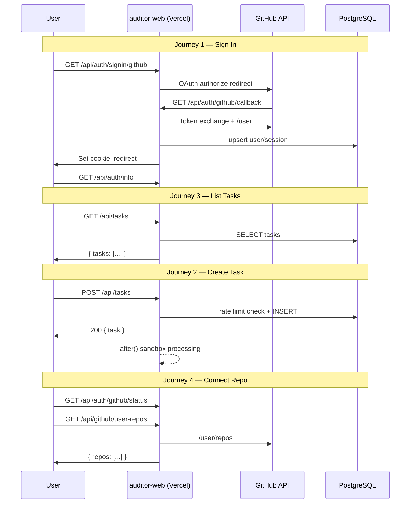

# Dokumen Desain Reliability Engineer — ARES auditor-web

| Field | Value |
|-------|-------|
| **Scope** | `apps/auditor-web` (SRE / SLO) |
| **Version** | 2026-08-04 · Draft v1 |
| **Status** | Design-only — synthetic probes, OTel instrumentation, runbooks not deployed |
| **Related docs** | [observability-auditor-web.md](./observability-auditor-web.md) · [infrastructure-platform.md](./infrastructure-platform.md) |

---

## 1. Alur Pengguna Kritis

Empat journey ini dipetakan langsung dari kode produksi. Setiap journey mencakup endpoint, dependensi eksternal, dan failure mode yang relevan.

### 1.1 Sign in with GitHub

| Langkah | Komponen | Endpoint / Aksi | Dependensi |
|--------|----------|-----------------|------------|
| 1 | UI | `startGitHubOAuth()` → redirect | Browser |
| 2 | API | `GET /api/auth/signin/github?next=<path>` | Cookie store, `NEXT_PUBLIC_GITHUB_CLIENT_ID` |
| 3 | Eksternal | Redirect ke `github.com/login/oauth/authorize` | GitHub OAuth |
| 4 | Callback | `GET /api/auth/github/callback?code=&state=` | GitHub token API, GitHub user API, PostgreSQL (`users`, `accounts`) |
| 5 | Session | Cookie JWE diset via `saveSession()` | `JWE_SECRET` |
| 6 | Hydration | `SessionProvider` → `GET /api/auth/info` | Cookie read, optional Vercel token refresh |

**Mode OAuth (server-side):**
- **signin** — user belum login atau login via GitHub (refresh token)
- **connect** — user Vercel menghubungkan GitHub ke akun existing

**Failure modes:**
- `400 Invalid OAuth state` — cookie state expired (10 menit) atau mismatch
- `500 GitHub OAuth not configured` — env var hilang
- Token exchange / profile fetch gagal → `400`/`500`
- DB unavailable → session creation gagal → `500`

**Catatan Supabase:** Route alternatif `GET /auth/callback` (PKCE Supabase) ada untuk provider Web3/GitHub via Supabase; journey utama dashboard saat ini memakai Arctic OAuth di `/api/auth/*`.

---

### 1.2 Create Task

| Langkah | Komponen | Endpoint / Aksi | Dependensi |
|--------|----------|-----------------|------------|
| 1 | UI | `home-page-content.tsx` / `task-form.tsx` → `POST /api/tasks` | Session cookie |
| 2 | Auth | `getServerSession()` | JWE decrypt |
| 3 | Rate limit | `checkRateLimit(userId)` | PostgreSQL (`tasks`, `taskMessages`) |
| 4 | Persist | Insert ke `tasks` (status `pending`) | PostgreSQL |
| 5 | Response | `200 { task }` — **sinkron, cepat** | — |
| 6 | Async | `after()` → sandbox + agent execution | Vercel Sandbox, GitHub API, AI providers |

**Rate limit:** Daily quota = tasks created today + user messages today (UTC midnight reset).  
**Endpoint quota:** `GET /api/auth/rate-limit` (auth required, `401` jika belum login).

**Failure modes:**
- `401 Unauthorized` — tidak ada session
- `429 Rate limit exceeded` — quota harian habis (bukan infra failure; symptom user-facing)
- `500 Failed to create task` — DB insert gagal
- Async failure (sandbox/agent) — task status → `error`; **tidak** memengaruhi SLI HTTP POST (sudah 200)

**Vercel config:** `app/api/tasks/route.ts` → `maxDuration: 300` (5 menit) untuk proses async di `after()`.

---

### 1.3 List Tasks

| Langkah | Komponen | Endpoint / Aksi | Dependensi |
|--------|----------|-----------------|------------|
| 1 | Layout mount | `AppLayout.fetchTasks()` | — |
| 2 | API | `GET /api/tasks` | Session + PostgreSQL |
| 3 | Render | Sidebar task list | Client state |

**Query:** Tasks milik user, `deletedAt IS NULL`, ordered by `createdAt DESC`.

**Failure modes:**
- `401` → UI tampilkan empty list (graceful)
- `500` → sidebar kosong, error di console
- Slow DB → p95 latency naik (symptom utama)

**Polling tambahan:** `GET /api/tasks/[taskId]` via `useTask` hook (detail page, bukan journey list).

---

### 1.4 Connect GitHub Repo

Journey ini mencakup **koneksi akun GitHub** dan **seleksi repo** untuk audit.

| Langkah | Komponen | Endpoint / Aksi | Dependensi |
|--------|----------|-----------------|------------|
| 1 | Status check | `GET /api/auth/github/status` | Session + DB (`accounts`, `users`) |
| 2a | Connect (Vercel user) | `GET /api/auth/signin/github` (mode `connect`) | Same as OAuth connect flow |
| 2b | Legacy connect | `GET/POST /api/auth/github/signin` | Requires Vercel session |
| 3 | List repos | `GET /api/github/user-repos?page=&search=` | GitHub API + user token |
| 4 | Verify (optional) | `GET /api/github/verify-repo` | GitHub API |
| 5 | UI | `task-sidebar.tsx` / `repo-selector.tsx` | Client |

**Failure modes:**
- `{ connected: false }` — belum connect (expected, bukan error)
- `401 GitHub not connected` pada `/api/github/user-repos`
- GitHub API rate limit / timeout → `500 Failed to fetch repositories`
- Token expired → perlu re-OAuth (symptom: repo list kosong + 401)

---

### Diagram Alur (Ringkas)



---

## 2. SLI dan SLO (table per journey with error budget)

**Window:** Rolling 30 hari  
**Error budget formula:** `budget = (1 - SLO) × total_requests` (availability) atau `(1 - SLO) × total_events` (latency)

### 2.1 Ringkasan SLO Global

| Dimensi | Target MVP | Error Budget (30 hari) |
|---------|-----------|------------------------|
| **Availability (platform)** | 99.5% | ~3.6 jam downtime |
| **p95 page/API GET (non-OAuth)** | < 300 ms | 5% requests boleh > 300 ms |
| **p95 OAuth end-to-end** | < 2 s | 5% flows boleh > 2 s |
| **Synthetic probe success** | 99.9% | ~43 menit failed checks (1 min interval) |

---

### 2.2 Journey: Sign In with GitHub

| SLI | Definisi (good event) | SLO | Error Budget (per 1000 attempts) |
|-----|----------------------|-----|----------------------------------|
| **Availability — callback** | `GET /api/auth/github/callback` returns 302 (signin) or redirect (connect), not 5xx | 99.5% | 5 failures |
| **Availability — session hydration** | `GET /api/auth/info` returns 200 with valid JSON | 99.9% | 1 failure |
| **Latency — OAuth redirect start** | `GET /api/auth/signin/github` p95 < 200 ms | 95% < 200 ms | 50 slow |
| **Latency — callback completion** | Callback p95 < 2 s (termasuk GitHub API) | 95% < 2 s | 50 slow |
| **Success rate — full flow** | User lands on `next` path with session cookie set | 99.0% | 10 failed sign-ins |

**Excluded from SLI:** User menolak consent di GitHub (`error=access_denied`) — counted as user error, bukan service failure.

---

### 2.3 Journey: Create Task

| SLI | Definisi | SLO | Error Budget (per 1000 POST) |
|-----|----------|-----|------------------------------|
| **Availability — accept** | `POST /api/tasks` returns 200 or 429 (quota) within 10 s | 99.5% | 5 failures (5xx/timeout only; 429 = success quota enforcement) |
| **Latency — accept** | p95 `POST /api/tasks` < 500 ms (DB insert only) | 95% < 500 ms | 50 slow |
| **Task lifecycle — start** | Task transitions `pending` → `processing` within 60 s | 98.0% | 20 stuck |
| **Task lifecycle — complete** | Task reaches `completed` or `error` (not stuck `processing` > maxDuration) | 95.0% | 50 stuck/timeout |

**Pemisahan SLI:** HTTP accept (user-facing, sync) vs task lifecycle (async, monitored terpisah). Async failure tidak boleh dihitung sebagai HTTP 5xx jika POST sudah 200.

---

### 2.4 Journey: List Tasks

| SLI | Definisi | SLO | Error Budget (per 10k GET) |
|-----|----------|-----|----------------------------|
| **Availability** | `GET /api/tasks` returns 200 for authenticated user | 99.5% | 50 failures |
| **Latency** | p95 < 300 ms | 95% < 300 ms | 500 slow |
| **Correctness** | Response contains only user's tasks, no soft-deleted | 99.99% | 1 leak/wrong data |

**Excluded:** `401` for unauthenticated — expected behavior, not counted against availability SLI.

---

### 2.5 Journey: Connect GitHub Repo

| SLI | Definisi | SLO | Error Budget (per 1000 calls) |
|-----|----------|-----|-------------------------------|
| **Status check availability** | `GET /api/auth/github/status` returns 200 | 99.5% | 5 failures |
| **Connect flow success** | Connect OAuth completes without 5xx | 99.0% | 10 failures |
| **Repo list availability** | `GET /api/github/user-repos` returns 200 for connected user | 99.0% | 10 failures |
| **Repo list latency** | p95 < 1 s (GitHub upstream) | 95% < 1 s | 50 slow |

**429 dari GitHub API:** Counted as upstream dependency failure; alert sebagai symptom "repo list degraded", bukan root cause DB.

---

## 3. Metrik (names, labels, cardinality warnings)

### 3.1 Konvensi Naming

Prefix: `ares_auditor_web_`  
Format: `{prefix}{subsystem}_{metric}_{unit}`  
Labels standar (low cardinality):

| Label | Values | Cardinality |
|-------|--------|-------------|
| `env` | `production`, `preview` | 2 |
| `route` | Normalized path template, e.g. `/api/tasks`, `/api/auth/github/callback` | ~15 critical |
| `method` | `GET`, `POST`, `PATCH`, `DELETE` | 4 |
| `status_class` | `2xx`, `4xx`, `5xx` | 3 |
| `journey` | `signin`, `create_task`, `list_tasks`, `connect_repo` | 4 |
| `auth_provider` | `github`, `vercel`, `none` | 3 |
| `check_type` | `synthetic`, `real` | 2 |

**⚠️ JANGAN gunakan label high-cardinality:**
- `user_id`, `task_id`, `repo_url`, `github_username` — gunakan log sampling atau trace ID terpisah
- `error_message` — aggregate ke `error_type` enum (`db_timeout`, `github_401`, `oauth_state_mismatch`, dll.)

---

### 3.2 Metrik HTTP (Vercel / OpenTelemetry)

| Metrik | Tipe | Labels | Deskripsi |
|--------|------|--------|-----------|
| `ares_auditor_web_http_requests_total` | Counter | `route`, `method`, `status_class`, `journey` | Total requests |
| `ares_auditor_web_http_request_duration_ms` | Histogram | `route`, `method`, `journey` | Latency buckets: 50, 100, 200, 300, 500, 1000, 2000, 5000 |
| `ares_auditor_web_http_errors_total` | Counter | `route`, `error_type` | 5xx only |

**Critical routes untuk labeling:**

```
/api/auth/info
/api/auth/signin/github
/api/auth/github/callback
/api/auth/github/status
/api/auth/rate-limit
/api/auth/signout
/api/tasks
/api/tasks/[taskId]
/api/github/user-repos
```

---

### 3.3 Metrik Business / Journey

| Metrik | Tipe | Labels | Deskripsi |
|--------|------|--------|-----------|
| `ares_auditor_web_oauth_started_total` | Counter | `mode` (`signin`, `connect`) | OAuth flow initiated |
| `ares_auditor_web_oauth_completed_total` | Counter | `mode`, `outcome` (`success`, `user_denied`, `error`) | Callback outcome |
| `ares_auditor_web_session_hydration_total` | Counter | `has_user` (`true`, `false`) | `/api/auth/info` results |
| `ares_auditor_web_task_created_total` | Counter | `agent` (enum: claude, codex, …) | Task accepted |
| `ares_auditor_web_task_rate_limited_total` | Counter | — | 429 responses |
| `ares_auditor_web_task_status_transition_total` | Counter | `from`, `to` | Lifecycle transitions |
| `ares_auditor_web_task_processing_duration_ms` | Histogram | `outcome` (`completed`, `error`, `stopped`, `timeout`) | End-to-end async duration |
| `ares_auditor_web_github_connection_check_total` | Counter | `connected` (`true`, `false`) | Status endpoint |
| `ares_auditor_web_github_repos_fetched_total` | Counter | `outcome` | Repo list success/fail |

---

### 3.4 Metrik Dependency

| Metrik | Tipe | Labels | Deskripsi |
|--------|------|--------|-----------|
| `ares_auditor_web_db_query_duration_ms` | Histogram | `operation` (`select_tasks`, `insert_task`, `rate_limit_count`) | PostgreSQL latency |
| `ares_auditor_web_db_errors_total` | Counter | `operation`, `error_type` | Connection/query failures |
| `ares_auditor_web_github_api_duration_ms` | Histogram | `endpoint` (`token`, `user`, `repos`, `search`) | Upstream GitHub |
| `ares_auditor_web_github_api_errors_total` | Counter | `endpoint`, `status_code_class` | GitHub failures |
| `ares_auditor_web_sandbox_operations_total` | Counter | `operation` (`create`, `execute`, `shutdown`), `outcome` | Vercel Sandbox |

---

### 3.5 Metrik Synthetic

| Metrik | Tipe | Labels | Deskripsi |
|--------|------|--------|-----------|
| `ares_auditor_web_synthetic_probe_success` | Gauge | `probe_name`, `region` | 1 = pass, 0 = fail |
| `ares_auditor_web_synthetic_probe_duration_ms` | Gauge | `probe_name`, `region` | Round-trip latency |
| `ares_auditor_web_synthetic_probe_ssl_days_remaining` | Gauge | — | TLS cert expiry |

---

### 3.6 Cardinality Budget

| Scope | Max active series | Action jika exceeded |
|-------|-------------------|---------------------|
| Per route | 50 | Drop `status_code` detail, keep `status_class` |
| Global service | 5,000 | Review label explosion, alert platform team |
| Per user | 0 (forbidden) | Never label by user_id |

---

## 4. Aturan Alert (with runbook links as placeholders, severity, duration, recipients)

**Prinsip:** Alert pada **symptom user-facing**, bukan root cause. Setiap pageable alert harus **actionable** dengan runbook.

**Recipients:**
- **P1 page:** `#ares-oncall` (PagerDuty) + `@oncall-primary`
- **P2 page (business hours):** `#ares-engineering` (Slack)
- **P3 ticket:** Linear auto-create, no page

---

### 4.1 Platform / Synthetic

| ID | Symptom | Query / Kondisi | Severity | Duration | Recipients | Runbook |
|----|---------|-----------------|----------|----------|------------|---------|
| **A-001** | App tidak merespons dari luar | Synthetic `GET /api/auth/info` fail di ≥2 region | **P1** | 3 menit | PagerDuty | [RUNBOOK-A001-synthetic-down](https://docs.internal/runbooks/A001) |
| **A-002** | Latency platform tinggi | p95 `ares_auditor_web_http_request_duration_ms{route="/api/auth/info"}` > 500 ms | **P2** | 10 menit | Slack | [RUNBOOK-A002-high-latency](https://docs.internal/runbooks/A002) |
| **A-003** | Error rate platform tinggi | 5xx rate all routes > 1% | **P1** | 5 menit | PagerDuty | [RUNBOOK-A003-error-spike](https://docs.internal/runbooks/A003) |
| **A-004** | TLS cert expiry | `synthetic_probe_ssl_days_remaining` < 14 | **P3** | 1 hari | Linear ticket | [RUNBOOK-A004-tls](https://docs.internal/runbooks/A004) |

---

### 4.2 Journey: Sign In

| ID | Symptom | Kondisi | Severity | Duration | Recipients | Runbook |
|----|---------|---------|----------|----------|------------|---------|
| **A-101** | User tidak bisa sign in | OAuth callback 5xx rate > 2% | **P1** | 5 menit | PagerDuty | [RUNBOOK-A101-oauth-callback](https://docs.internal/runbooks/A101) |
| **A-102** | Sign-in lambat | p95 callback duration > 3 s | **P2** | 15 menit | Slack | [RUNBOOK-A102-oauth-slow](https://docs.internal/runbooks/A102) |
| **A-103** | Session tidak ter-hydrate | `/api/auth/info` 5xx rate > 0.5% | **P1** | 5 menit | PagerDuty | [RUNBOOK-A103-session-info](https://docs.internal/runbooks/A103) |
| **A-104** | Spike OAuth state errors | `error_type=oauth_state_mismatch` > 10/min (possible attack or cookie bug) | **P2** | 10 menit | Slack | [RUNBOOK-A104-oauth-state](https://docs.internal/runbooks/A104) |

**Non-alert (informational):** `user_denied` OAuth — dashboard only, no page.

---

### 4.3 Journey: Create Task

| ID | Symptom | Kondisi | Severity | Duration | Recipients | Runbook |
|----|---------|---------|----------|----------|------------|---------|
| **A-201** | User tidak bisa submit task | `POST /api/tasks` 5xx rate > 2% | **P1** | 5 menit | PagerDuty | [RUNBOOK-A201-task-post-fail](https://docs.internal/runbooks/A201) |
| **A-202** | Task accept lambat | p95 POST /api/tasks > 1 s | **P2** | 15 menit | Slack | [RUNBOOK-A202-task-post-slow](https://docs.internal/runbooks/A202) |
| **A-203** | Task stuck pending | > 20% tasks remain `pending` > 60 s (rolling 30 min) | **P2** | 10 menit | Slack | [RUNBOOK-A203-task-stuck-pending](https://docs.internal/runbooks/A203) |
| **A-204** | Task processing failure spike | `task_status_transition{to="error"}` > 30% of starts (1 h) | **P2** | 30 menit | Slack | [RUNBOOK-A204-task-errors](https://docs.internal/runbooks/A204) |

**Non-alert:** `429 rate_limited` spike — expected quota behavior; monitor di dashboard, page hanya jika 429 > 50% requests (possible misconfiguration quota).

---

### 4.4 Journey: List Tasks

| ID | Symptom | Kondisi | Severity | Duration | Recipients | Runbook |
|----|---------|---------|----------|----------|------------|---------|
| **A-301** | Sidebar task list kosong/error | `GET /api/tasks` 5xx rate > 1% | **P1** | 5 menit | PagerDuty | [RUNBOOK-A301-list-tasks-fail](https://docs.internal/runbooks/A301) |
| **A-302** | Task list lambat | p95 GET /api/tasks > 500 ms | **P2** | 15 menit | Slack | [RUNBOOK-A302-list-tasks-slow](https://docs.internal/runbooks/A302) |

---

### 4.5 Journey: Connect GitHub Repo

| ID | Symptom | Kondisi | Severity | Duration | Recipients | Runbook |
|----|---------|---------|----------|----------|------------|---------|
| **A-401** | Repo list tidak load | `/api/github/user-repos` 5xx rate > 5% | **P2** | 10 menit | Slack | [RUNBOOK-A401-repos-fail](https://docs.internal/runbooks/A401) |
| **A-402** | GitHub status check gagal | `/api/auth/github/status` 5xx rate > 1% | **P2** | 10 menit | Slack | [RUNBOOK-A402-github-status](https://docs.internal/runbooks/A402) |
| **A-403** | GitHub upstream degraded | `github_api_errors_total` > 10/min across endpoints | **P2** | 10 menit | Slack | [RUNBOOK-A403-github-upstream](https://docs.internal/runbooks/A403) |

---

### 4.6 Dependency

| ID | Symptom | Kondisi | Severity | Duration | Recipients | Runbook |
|----|---------|---------|----------|----------|------------|---------|
| **A-501** | Database unreachable | `db_errors_total` > 5/min OR connection pool exhausted | **P1** | 3 menit | PagerDuty | [RUNBOOK-A501-db-down](https://docs.internal/runbooks/A501) |
| **A-502** | DB slow | p95 `db_query_duration_ms{operation="select_tasks"}` > 200 ms | **P2** | 15 menit | Slack | [RUNBOOK-A502-db-slow](https://docs.internal/runbooks/A502) |

**Catatan:** Alert A-501 adalah symptom (DB errors manifest as 5xx on multiple routes). Jangan alert hanya pada "Postgres CPU high" tanpa correlasi ke user impact.

---

### 4.7 Alert Routing Summary

| Severity | Response SLA | Escalation |
|----------|-------------|------------|
| P1 | Acknowledge 5 min, mitigate 30 min | Auto-escalate @+15 min |
| P2 | Acknowledge 30 min (business hours) | Escalate to P1 if > 1 h |
| P3 | Next business day | — |

---

## 5. Dasbor (overview + per-component)

### 5.1 Overview Dashboard — "ARES auditor-web Health"

**Row 1 — SLO Status (30-day rolling)**
- Availability gauge (target 99.5%, remaining error budget hours)
- p95 latency gauge (target 300 ms)
- OAuth p95 gauge (target 2 s)
- Synthetic probe uptime (target 99.9%)

**Row 2 — Traffic & Errors**
- Request rate by `journey` (stacked area)
- Error rate 5xx by `route` (top 5)
- 4xx breakdown (401 vs 429 vs 400)

**Row 3 — Critical Journeys (single stat + sparkline)**
- Sign-in success rate (24 h)
- Task create accept rate (24 h)
- Task list availability (24 h)
- Repo list availability (24 h)

**Row 4 — Dependencies**
- PostgreSQL query p95
- GitHub API error rate
- Vercel function duration p95 (from Vercel dashboard embed)

---

### 5.2 Per-Component Dashboards

#### Auth (`/api/auth/*`)

| Panel | Metrik |
|-------|--------|
| OAuth funnel | `oauth_started` → `oauth_completed{outcome=success}` conversion |
| Callback latency | p50/p95/p99 histogram |
| Session hydration | `/api/auth/info` success rate + latency |
| OAuth errors by type | `error_type` breakdown (state_mismatch, token_exchange, db) |
| Sign-out rate | `signout` counter (anomaly detection) |

#### Tasks (`/api/tasks/*`)

| Panel | Metrik |
|-------|--------|
| POST accept rate & latency | 200 vs 429 vs 5xx |
| Rate limit utilization | `rate_limited_total` / `task_created_total` |
| Task lifecycle funnel | pending → processing → completed/error/stopped |
| Processing duration | p95 by `outcome` |
| Stuck tasks | Count where status=processing AND age > maxDuration |
| Agent distribution | `task_created_total` by `agent` |

#### GitHub Integration (`/api/github/*`, `/api/auth/github/*`)

| Panel | Metrik |
|-------|--------|
| Connection status | `github_connection_check{connected=true}` ratio |
| Repo fetch latency | p95 by page/search |
| GitHub API errors | by `endpoint` |
| OAuth connect vs signin | by `mode` |

#### Database

| Panel | Metrik |
|-------|--------|
| Query latency by operation | select_tasks, insert_task, rate_limit_count |
| Error rate | connection vs query timeout |
| Connection pool | active/idle (from postgres exporter if available) |

#### Vercel Platform (embed/link)

| Panel | Source |
|-------|--------|
| Function invocations | Vercel Analytics |
| Edge vs Serverless latency | Vercel Speed Insights |
| Cold start rate | Vercel Observability |
| `maxDuration` timeouts | Function logs filter `Task timed out` |

---

## 6. Pemeriksaan Sintetis

### 6.1 Probe Utama — Liveness (setiap 1 menit, multi-region)

| Probe | Method | URL | Expected | Regions |
|-------|--------|-----|----------|---------|
| **auth-info-liveness** | GET | `/api/auth/info` | `200`, `Content-Type: application/json`, body parses, `user` key present | `iad1`, `sfo1`, `fra1` |

**Rationale:** Endpoint ini dipanggil oleh `SessionProvider` setiap mount + 60 s interval. Tidak memerlukan auth (returns `{ user: undefined }` untuk anonymous). Validasi struktur JSON cukup; **jangan** assert `user` populated (butuh session).

**Assertion detail:**
```json
// Expected shape (anonymous)
{ "user": undefined }  // or { "user": null } depending on serializer

// HTTP
status == 200
content-type contains "application/json"
response_time < 1000ms (warning), < 3000ms (critical)
```

---

### 6.2 Probe Sekunder — Deep Health (setiap 5 menit)

| Probe | Method | URL | Auth | Expected |
|-------|--------|-----|------|----------|
| **homepage** | GET | `/` | No | 200, TTFB < 1 s |
| **tasks-unauth** | GET | `/api/tasks` | No | 401 (confirms route alive + auth gate works) |
| **github-status-unauth** | GET | `/api/auth/github/status` | No | 200, `{ connected: false }` |
| **rate-limit-unauth** | GET | `/api/auth/rate-limit` | No | 401 |
| **signin-redirect** | GET | `/api/auth/signin/github` | No | 302 to `github.com` (don't follow) |

**Catatan signin-redirect:** Validasi header `Location` contains `github.com/login/oauth/authorize`. Failure = misconfigured `NEXT_PUBLIC_GITHUB_CLIENT_ID` atau route error.

---

### 6.3 Probe Autentikasi (setiap 15 menit, dedicated test account)

| Probe | Flow | Expected |
|-------|------|----------|
| **authenticated-session** | Pre-seeded session cookie (CI vault) → `GET /api/auth/info` | 200, `user.id` present |
| **list-tasks-auth** | Same cookie → `GET /api/tasks` | 200, `tasks` array |
| **rate-limit-auth** | Same cookie → `GET /api/auth/rate-limit` | 200, `allowed/remaining/total/resetAt` fields |
| **github-status-auth** | Same cookie (connected account) → `GET /api/auth/github/status` | 200, `connected: true` |
| **user-repos-auth** | Same cookie → `GET /api/github/user-repos?per_page=1` | 200, `repos` array |

**Credential management:** Session cookie disimpan di secret manager (1Password/Vault), rotated monthly. Test account GitHub token scope minimal (`read:user`, `repo` read-only test repo).

---

### 6.4 Probe OAuth (setiap 1 jam — manual-assisted atau scripted)

OAuth penuh tidak bisa fully automated tanpa GitHub test app + stored refresh token. Strategi MVP:

1. **Semi-synthetic:** Script exchanges stored refresh token → validates callback path components
2. **Canary user:** Real sign-in oleh canary bot account setiap 6 jam
3. **Alert on:** Callback 5xx rate (A-101) covers regression

---

### 6.5 Synthetic Infrastructure

| Aspek | Rekomendasi MVP |
|-------|-----------------|
| **Tool** | Checkly / Better Stack / Datadog Synthetics |
| **Hosting** | External (bukan Vercel) — detect Vercel-wide outage |
| **Alerting** | A-001 (3 min, 2+ regions) |
| **Retention** | 90 hari raw, 1 tahun aggregated |

---

### 6.6 Synthetic vs SLI Mapping

| Synthetic Probe | SLI Covered |
|-----------------|-------------|
| auth-info-liveness | Platform availability, session hydration |
| tasks-unauth 401 | Auth middleware alive |
| list-tasks-auth | List tasks availability |
| rate-limit-auth | Rate limit endpoint + DB |
| user-repos-auth | GitHub integration + token validity |

---

## 7. Jaga Rotasi

### 7.1 Struktur On-Call (MVP — ~50 DAU)

| Role | Coverage | Responsibilities |
|------|----------|------------------|
| **Primary On-Call** | 24/7 (PagerDuty) | P1 alerts, initial triage, runbook execution |
| **Secondary On-Call** | 24/7 (escalation) | Backup jika primary no-ack 15 min |
| **Service Owner** | Business hours | SLO review, runbook updates, postmortem |

**Rotation:** Weekly, handoff Senin 09:00 UTC+7.

---

### 7.2 Handoff Checklist

- [ ] Review open incidents / degraded SLOs
- [ ] Check error budget burn rate (30-day window)
- [ ] Verify synthetic probes green (all regions)
- [ ] Review pending P3 tickets (A-004 TLS, etc.)
- [ ] Confirm test account session cookie valid
- [ ] Note scheduled deploys / migrations this week

---

### 7.3 Incident Response Flow

```
Alert fires (symptom)
    ↓
Acknowledge ≤ 5 min (P1)
    ↓
Check Overview Dashboard → identify affected journey
    ↓
Follow runbook (linked in alert)
    ↓
If dependency (GitHub/Vercel/DB): update status page, communicate workaround
    ↓
Mitigate → Monitor recovery ≥ 15 min
    ↓
Resolve alert → Postmortem if SLO breach or P1 > 30 min
```

---

### 7.4 Runbook Minimum Viable Set (prioritas implementasi)

| Priority | Runbook | Trigger |
|----------|---------|---------|
| 1 | A-001 Synthetic down | App unreachable |
| 2 | A-501 DB down | Multiple 5xx |
| 3 | A-101 OAuth callback fail | Sign-in broken |
| 4 | A-201 Task POST fail | Cannot create tasks |
| 5 | A-301 List tasks fail | Sidebar empty |

Setiap runbook harus memuat:
1. **Symptom** — apa yang user liami
2. **Verify** — query/dashboard untuk konfirmasi
3. **Mitigate** — langkah konkret (rollback, scale, failover)
4. **Escalate** — kapan hubungi Vercel/GitHub/DBA support
5. **Resolve criteria** — metrik kembali normal ≥ 15 min

---

### 7.5 SLO Review Cadence

| Ritual | Frekuensi | Participants |
|--------|-----------|--------------|
| Error budget review | Weekly | Eng + Product |
| SLO tuning | Quarterly | Eng + SRE |
| Game day (OAuth fail, DB fail) | Quarterly | On-call rotation |
| Runbook drill | Monthly | Primary on-call |

---

### 7.6 Escalation Matrix

| Layer | Contact | When |
|-------|---------|------|
| L1 | Primary on-call | All P1/P2 |
| L2 | Secondary + Service Owner | P1 > 30 min unresolved |
| L3 | Vercel Support | Platform-wide function failures |
| L3 | GitHub Support | OAuth app / API widespread issues |
| L3 | Database provider | Connection pool / replication issues |

---

## Self-Check Checklist

| # | Kriteria | Status |
|---|----------|--------|
| 1 | Empat critical journeys dipetakan ke endpoint aktual di codebase | ✅ |
| 2 | `/api/auth/rate-limit` (auth required, daily quota) tercakup | ✅ |
| 3 | `/api/auth/info` sebagai synthetic probe utama | ✅ |
| 4 | SLI/SLO per journey dengan error budget numerik | ✅ |
| 5 | Baseline 99.5% availability, p95 300 ms / OAuth 2 s | ✅ |
| 6 | Metrik naming + cardinality warnings | ✅ |
| 7 | Alert pada symptom (5xx, latency, synthetic fail), bukan cause (CPU) | ✅ |
| 8 | Setiap pageable alert (P1/P2) punya runbook placeholder + duration + recipients | ✅ |
| 9 | Dashboard overview + per-component (auth, tasks, github, db) | ✅ |
| 10 | Pemisahan SLI sync (HTTP POST 200) vs async (task lifecycle) | ✅ |
| 11 | 401/429 handled correctly (excluded or non-page) | ✅ |
| 12 | Vercel hosting context (maxDuration 300, `after()` async) | ✅ |
| 13 | Dokumen dalam Bahasa Indonesia, istilah teknis OK | ✅ |
| 14 | ~50 DAU / low QPS reflected (weekly rotation, no over-engineering) | ✅ |

---

**Next steps implementasi (opsional):**
1. Instrumentasi OpenTelemetry di route handlers kritis
2. Deploy synthetic probe `auth-info-liveness` (Checkly/Better Stack)
3. Tulis 5 runbook prioritas (A-001, A-501, A-101, A-201, A-301)
4. Embed Vercel Observability + custom dashboard di Grafana/Datadog

[REDACTED]