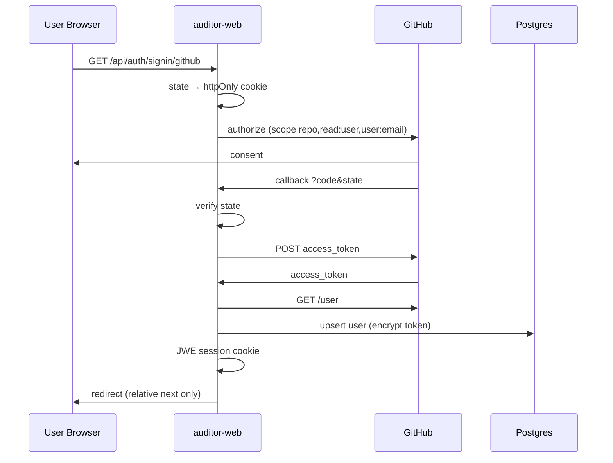

# Dokumen Desain Defensif — ARES Platform (`apps/auditor-web`)

| Field | Value |
|-------|-------|
| **Scope** | `apps/auditor-web` + konteks monorepo ARES |
| **Version** | 2026-08-04 |
| **Status** | Design-only — CSP/HSTS headers, SIEM audit trail, PKCE dashboard OAuth not implemented |
| **Related docs** | [auth-auditor-web.md](./auth-auditor-web.md) · [observability-auditor-web.md](./observability-auditor-web.md) |

---

## Konteks Arsitektur

| Komponen | Peran |
|----------|-------|
| `apps/auditor-web` | Next.js 16 monolith — UI task, OAuth dashboard, API route handlers |
| Postgres (`POSTGRES_URL`) | Identitas dashboard, task, token OAuth terenkripsi, API keys user |
| Supabase Auth + Data API | JWT + RBAC untuk knowledge base (`documents`, `chunks`) — **terpisah** dari session dashboard |
| GitHub / Vercel OAuth | Delegasi akses repo & sandbox |
| `@vercel/sandbox` | Eksekusi agent di lingkungan terisolasi |
| Root CI (`.github/workflows/ci.yml`) | License GPL/AGPL, import-boundary `ares-sec`, npm audit |
| `apps/auditor-web` PR checks | lint, format, build (pnpm) — **tidak** menjalankan gate monorepo |

**Dual auth (desain prior, jangan kontradiksi):**

| Flow | Mekanisme | Cookie / Token | Callback |
|------|-----------|----------------|----------|
| **Dashboard** | GitHub/Vercel OAuth → JWE session | `_user_session_` (HttpOnly) | `/api/auth/github/callback` |
| **Knowledge Base** | Supabase GitHub Auth (PKCE) | Supabase SSR cookies | `/auth/callback` → Supabase `/auth/v1/callback` |

Unifikasi login (INT-4) **belum** dilakukan — keduanya independen.

---

## 1. Batas Kepercayaan

### 1.1 Zona dan tingkat kepercayaan

```
┌─────────────────────────────────────────────────────────────────┐
│  UNTRUSTED: Browser pengguna (JS, extension, XSS surface)       │
└───────────────────────────┬─────────────────────────────────────┘
                            │ HTTPS (prod), SameSite=Lax cookies
┌───────────────────────────▼─────────────────────────────────────┐
│  SEMI-TRUSTED: Next.js edge/server (auditor-web)                │
│  - Memegang JWE_SECRET, ENCRYPTION_KEY, OAuth client secrets    │
│  - Tidak expose secret ke client (kecuali NEXT_PUBLIC_*)        │
└───────┬─────────────────────────────┬───────────────────────────┘
        │ TLS                         │ TLS + scoped tokens
┌───────▼──────────┐         ┌────────▼──────────────────────────┐
│ TRUSTED (app):   │         │ EXTERNAL (limited trust):         │
│ Postgres dash    │         │ GitHub API, Vercel API,           │
│ (encrypted cols) │         │ Vercel Sandbox, LLM providers     │
└──────────────────┘         └───────────────────────────────────┘

┌─────────────────────────────────────────────────────────────────┐
│  PARALLEL TRUST PLANE: Supabase (KB)                           │
│  anon key (public) + JWT authenticated + RLS deny-by-default    │
│  service_role: agent ingest/recall ONLY server-side             │
└─────────────────────────────────────────────────────────────────┘
```

### 1.2 Asumsi kepercayaan

| Entitas | Dipercaya untuk | Tidak dipercaya untuk |
|---------|-----------------|----------------------|
| Browser | Render UI, kirim request autentikasi | Menyimpan OAuth token, API key, atau `ENCRYPTION_KEY` |
| Next.js server | Validasi session, enkripsi/dekripsi server-side, ownership check | Input mentah tanpa validasi; log isi secret |
| Postgres dashboard | Persistensi dengan FK `userId` | Perlindungan jika `POSTGRES_URL` bocor — asumsikan DB perlu dianggap compromised |
| Supabase `authenticated` | Akses KB sesuai RLS + `authorize()` | Akses lintas tenant tanpa claim `user_role` |
| Supabase `service_role` | Pipeline agent (ingest/recall) | Exposure ke browser atau repo |
| GitHub/Vercel | Identitas OAuth, scope token | Integritas data task ARES; availability |
| Vercel Sandbox | Isolasi eksekusi agent | Kerahasiaan kode user jika misconfigured |
| Monorepo CI | Enforce GPL/AGPL block, import-boundary | Menggantikan review manual dependency |

### 1.3 Batas produk (GOLDEN RULE 1)

- Seluruh repo **Apache-2.0**; **GPL/AGPL** diblokir di CI (`scripts/check-licenses.mjs`, `core/deny.toml`).
- `apps/ares-sec/` (offensive) **dilarang** diimpor ke sisi Auditor — `scripts/check-import-boundary.mjs` scan `src/`, `core/`, `services/`, `packages/`, `apps/auditor-*`.
- Batas ini untuk **safety & product hygiene**, bukan license firewall.

### 1.4 MVP constraints (diterima)

- **Tidak ada Redis** — session stateless di cookie JWE; rate limit di Postgres.
- **Tidak ada middleware auth global** — setiap API route memanggil `getServerSession()` / `getSessionFromReq()` sendiri.
- **Tidak ada unified auth** dashboard ↔ Supabase (INT-4 planned).

---

## 2. Model Ancaman (STRIDE)

| Ancaman (STRIDE) | Komponen | P (1–5) | D (1–5) | Kontrol yang diterapkan | Risiko residual |
|------------------|----------|---------|---------|-------------------------|-----------------|
| **Spoofing** — session forgery | JWE cookie `_user_session_` | 3 | 5 | JWE `dir` + `A256GCM` (`lib/jwe/*`); secret server-only; HttpOnly + Secure (prod) + SameSite=Lax | Rotasi `JWE_SECRET` invalidates semua session; TTL 1 tahun panjang |
| **Spoofing** — OAuth CSRF | `/api/auth/signin/github` | 3 | 4 | `state` random (`arctic.generateState`), httpOnly cookie 10 menit, verifikasi di callback | **PKCE belum** di dashboard OAuth — diterima; rekomendasi tambah sebelum exposure luas |
| **Tampering** — akses task user lain | API `/api/tasks/*` | 4 | 5 | Query `eq(tasks.userId, session.user.id)` + soft-delete filter | IDOR jika route baru lupa ownership check |
| **Tampering** — manipulasi JWT KB claim | Supabase RLS | 3 | 4 | `custom_access_token_hook` inject `user_role`; `authorize()` SECURITY DEFINER; hook hanya `supabase_auth_admin` | Compromise `supabase_auth_admin` atau service_role |
| **Repudiation** — deny aksi user | Task logs, auth events | 2 | 2 | Log statis di task (`AGENTS.md`); server `console.error` untuk auth | Tidak ada audit trail terpusat / SIEM |
| **Information Disclosure** — token di log UI | Task logger → DB → UI | 4 | 5 | Kebijakan log **statis saja**; `redactSensitiveInfo()` backup | Beberapa `console.log` server masih dynamic (user ID) — bukan user-facing tapi ada di server logs |
| **Information Disclosure** — DB dump | `users.access_token`, `keys.value` | 3 | 5 | AES-256-CBC + random IV (`lib/crypto.ts`) | CBC **tanpa autentikasi** — bit-flip mungkin; assume key rotation + breach response |
| **Information Disclosure** — `.env` commit | Repo git | 4 | 5 | `.gitignore`: `.env*` | Human error; secret scanning disarankan (belum di CI auditor-web) |
| **Information Disclosure** — KB via anon | Supabase Data API | 3 | 4 | `0003_data_api_security.sql`: revoke default grants; RLS; `anon` tanpa akses KB | Mis-grant pada tabel baru jika lupa opt-in pattern |
| **DoS** — spam task/message | `/api/tasks` POST | 3 | 3 | `checkRateLimit()` per user per hari (Postgres count) | Tidak ada edge/WAF rate limit; brute force OAuth state |
| **DoS** — sandbox resource | Vercel Sandbox | 3 | 4 | `maxDuration`, shutdown hooks | Cost exhaustion jika limit platform longgar |
| **Elevation of Privilege** — KB admin | `user_roles` table | 2 | 5 | RLS on RBAC tables; no client policy; assignment manual SQL | Operator error granting `admin` |
| **Elevation of Privilege** — import ares-sec | Monorepo TS/Rust | 2 | 5 | CI import-boundary | Bypass hanya jika CI dilemahkan |
| **Elevation of Privilege** — open redirect | OAuth `next` param | 3 | 3 | `isRelativeUrl()` — tolak absolute URL | Subpath open redirect edge cases minimal |

**Legenda:** P = Probabilitas, D = Dampak (skala relatif operasional, bukan CVSS formal).

---

## 3. Klasifikasi Data

| Kategori | Contoh | Lokasi | Kerahasiaan | Integritas | Ketersediaan | Kontrol |
|----------|--------|--------|-------------|------------|--------------|---------|
| **Kritis — Secret platform** | `JWE_SECRET`, `ENCRYPTION_KEY`, `GITHUB_CLIENT_SECRET`, `VERCEL_CLIENT_SECRET`, `POSTGRES_URL` | Env server / Vercel secrets | Tinggi | Tinggi | Sedang | Never `NEXT_PUBLIC_`; `.gitignore` `.env*` |
| **Kritis — Secret user** | GitHub/Vercel OAuth token, LLM API keys | Postgres kolom terenkripsi | Tinggi | Tinggi | Sedang | `encrypt()` sebelum write; revoke on signout |
| **Sensitif — Session** | Payload JWE (user id, email, avatar) | Cookie HttpOnly | Sedang | Tinggi | Sedang | JWE A256GCM; no localStorage |
| **Sensitif — Identitas** | Email, username, GitHub numeric ID | `users`, `accounts`, session | Sedang | Tinggi | Sedang | Key by `externalId` (GitHub id), bukan login alone |
| **Sensitif — Kode & repo** | Clone sandbox, diff, PR | Sandbox + GitHub | Tinggi | Sedang | Sedang | Token scoped `repo`; ownership task |
| **Internal — Operasional** | Task prompt, agent logs | `tasks.logs` JSONB | Sedang | Sedang | Sedang | User-scoped queries; log redaction |
| **Internal — KB** | `documents`, `chunks`, embeddings | Supabase Postgres | Sedang–Tinggi | Tinggi | Sedang | RLS + RBAC JWT |
| **Publik** | `NEXT_PUBLIC_GITHUB_CLIENT_ID`, `NEXT_PUBLIC_SUPABASE_URL/ANON_KEY` | Browser bundle | Rendah | Sedang | Tinggi | By design public OAuth/Supabase anon |

**Retensi (MVP — kebijakan operasional, belum fully automated):**

- Task soft-delete (`deletedAt`) — hard purge perlu prosedur ops.
- Token OAuth — hidup sampai revoke/signout atau user revoke di GitHub.
- Session JWE — max ~1 tahun (`saveSession`, `encryptJWE(..., '1y')`).

---

## 4. Kontrol Masukan

### 4.1 Autentikasi & otorisasi

| Layer | Pola | Implementasi |
|-------|------|--------------|
| Dashboard API | Deny by default | `if (!session?.user?.id) return 401` |
| Object-level | Ownership | `eq(tasks.userId, session.user.id)` di route handlers |
| KB Supabase | Deny by default + RBAC | RLS `authorize('knowledge.*')`; `anon` revoked |
| Provider enum | Allowlist | API keys: `['openai','gemini','cursor','anthropic','aigateway']` |

Tidak ada middleware Next.js terpusat — **setiap route baru wajib** mengikuti pola di atas (review checklist).

### 4.2 Validasi skema

- **Zod** pada schema DB (`insertTaskSchema`, `insertUserSchema`, dll.) — contoh: `POST /api/tasks` memanggil `insertTaskSchema.parse()` dengan `userId` dari session (bukan body client).
- **OAuth state**: callback abort `400` jika `state` ≠ cookie atau cookie expired (10 menit).
- **Redirect safety**: `isRelativeUrl()` — parameter `next` harus path relatif (bukan `https://evil.com`).
- **Supabase callback**: `next` harus diawali `/` (`app/auth/callback/route.ts`).

### 4.3 OAuth scope minimization (dashboard)

Scope diminta: `repo,read:user,user:email` — documented di `docs/user/guides/github-auth.mdx`. Scope efektif bisa lebih kecil jika user mengurangi di GitHub Settings.

### 4.4 Rate limiting

- `checkRateLimit(userId)`: hitung task + user messages hari ini (UTC) vs `getMaxMessagesPerDay(userId)`.
- Exposed via `GET /api/auth/rate-limit` (authenticated).
- **Batasan:** Postgres-backed, bukan distributed token bucket; tidak melindungi route auth anonim.

### 4.5 Sandbox & agent input

- Task `prompt` divalidasi via Zod; eksekusi di Vercel Sandbox dengan credential user terdekripsi server-side.
- **Risiko diterima:** prompt injection ke LLM agent — mitigasi produk (bukan security boundary klasik) via policy & sandbox isolation.

---

## 5. Kredensial dan Secret

### 5.1 Inventori variabel (dashboard)

| Variable | Exposure | Fungsi |
|----------|----------|--------|
| `JWE_SECRET` | Server only | Kunci simetris JWE session (base64url decode di `jose`) |
| `ENCRYPTION_KEY` | Server only | 32-byte hex (64 char) — AES-256-CBC at-rest |
| `GITHUB_CLIENT_SECRET` | Server only | OAuth token exchange |
| `VERCEL_CLIENT_SECRET` | Server only | Vercel OAuth |
| `POSTGRES_URL` | Server only | Drizzle/postgres-js |
| `NEXT_PUBLIC_GITHUB_CLIENT_ID` | Public | OAuth authorize URL |
| `NEXT_PUBLIC_AUTH_PROVIDERS` | Public | Provider toggle |
| `NEXT_PUBLIC_SUPABASE_URL/ANON_KEY` | Public | Supabase browser/server anon client |
| `SUPABASE_SERVICE_ROLE_KEY` | **Agent/server root only** — **bukan** auditor-web browser | Bypass RLS ingest/recall |

Referensi env: `README.md`, `docs/user/guides/github-auth.mdx` (`.env.local.example` disebut di README; file di-ignore git).

### 5.2 Enkripsi at-rest (`lib/crypto.ts`)

```
Format: {iv_hex}:{ciphertext_hex}
Algorithm: AES-256-CBC, IV 16 byte random per encrypt
Key: ENCRYPTION_KEY (hex → 32 bytes)
```

**Diterapkan pada:** `users.accessToken`, `accounts.accessToken`, `keys.value`, connector secrets (`lib/actions/connectors.ts`).

**Risiko diterima:** CBC tanpa MAC/AEAD — integritas ciphertext tidak diverifikasi kriptografis; mitigasi operasional = DB access control + key rotation procedure.

### 5.3 Session JWE (`lib/jwe/encrypt.ts`, `decrypt.ts`)

```
Header: alg=dir, enc=A256GCM
TTL: 1y (cookie Max-Age + JWE exp)
Cookie: _user_session_; HttpOnly; SameSite=Lax; Secure in production
```

Decrypt gagal → silent `undefined` (session dianggap absent).

### 5.4 OAuth token lifecycle

| Event | Perilaku |
|-------|----------|
| Sign-in | Exchange code → encrypt → Postgres; JWE cookie set |
| Sign-out | `DELETE` GitHub token API / Vercel revoke; clear cookie |
| Connect flow | Token ke `accounts`; merge user jika GitHub id collision |

### 5.5 Rotasi secret (prosedur target)

1. **Client secret bocor** — rotate di GitHub/Vercel app, update deployment env.
2. **ENCRYPTION_KEY / JWE_SECRET compromise** — generate baru, re-encrypt tokens (migration script), invalidate sessions (semua user re-auth).
3. **POSTGRES_URL compromise** — rotate cred DB, assume ciphertext + tokens perlu revoke massal.

---

## 6. Rantai Pasok Dependensi

### 6.1 Gate CI monorepo (`.github/workflows/ci.yml`)

| Gate | Tool | Scope |
|------|------|-------|
| npm audit | `npm audit --audit-level=high` | Root npm tree |
| pip audit | `pip-audit` | `eval/requirements.txt` |
| License npm | `scripts/check-licenses.mjs` | Production deps; block GPL/AGPL; LGPL explicit pass |
| License Rust | `cargo-deny` (`core/deny.toml`) | Engine workspace |
| Import boundary | `scripts/check-import-boundary.mjs` | No `ares-sec` in Auditor tree |
| Verify-claims | `eval/check_published_claims.py` | No unverified metrics in README |

### 6.2 Gate `apps/auditor-web` (`.github/workflows/pr-checks.yml`)

- pnpm: `lint`, `format:check`, `build`
- **Gap:** PR checks auditor-web **tidak** menjalankan license/import-boundary — mengandalkan root CI on merge to `main`.

### 6.3 Prinsip dependency

- Repo **Apache-2.0**; dependensi strong-copyleft **ditolak** otomatis.
- UI: shadcn/ui (MIT, copy-paste) — bukan npm black box.
- Shell template: vercel-labs/coding-agent-template (Apache-2.0).

### 6.4 Rekomendasi operasional (belum otomatis)

- GitHub Dependabot / secret scanning pada repo deployment.
- Pin & review `@vercel/sandbox`, `@octokit/rest`, `jose` pada setiap major bump.

---

## 7. Transport dan Penyimpanan

### 7.1 Transport

| Jalur | Kontrol |
|-------|---------|
| Browser ↔ Next.js | HTTPS wajib production; cookie `Secure` when `NODE_ENV=production` |
| Next.js ↔ GitHub/Vercel | TLS; Bearer token server-side only |
| Next.js ↔ Postgres | TLS (tergantung provider — Neon/Vercel Postgres) |
| Browser ↔ Supabase | HTTPS; PKCE flow Supabase Auth |
| Agent ↔ Supabase KB | `service_role` server-side only |

### 7.2 Penyimpanan

| Store | Isi | Proteksi |
|-------|-----|----------|
| Postgres dashboard | Users, tasks, encrypted tokens/keys | App-level encryption + FK cascade |
| Cookie browser | JWE session / Supabase session | HttpOnly, path `/` |
| Supabase KB | Documents/chunks | RLS + explicit grants (`0003_data_api_security.sql`) |
| Vercel Sandbox | Ephemeral clone | Isolated VM; credentials injected at runtime |

### 7.3 RBAC & RLS Supabase (KB)

**`0002_rbac.sql`:**
- Roles: `admin`, `auditor`, `viewer`
- Permissions: `knowledge.read|write|delete`
- `authorize(requested_permission)` reads JWT claim `user_role`
- RLS on `documents`, `chunks`

**`0003_data_api_security.sql`:**
- Default privileges: **revoke** broad grants untuk `anon`, `authenticated`, `service_role` on new objects
- `anon`: no KB access
- `authenticated`: explicit grant + RLS
- `service_role`: full KB + RBAC tables (bypass RLS)
- `user_roles` / `role_permissions`: RLS enabled, **no client policies** — deny direct access

### 7.4 Postgres dashboard — ownership model

- `tasks.userId` → `users.id` ON DELETE CASCADE
- API keys scoped `keys.userId`
- Accounts linked per user; GitHub connect flow may merge users on collision

**Tidak ada RLS Postgres dashboard** — authorization purely application-layer (Drizzle queries).

---

## 8. Header dan Konfigurasi

### 8.1 Status saat ini (`next.config.ts`)

- Hanya `images.remotePatterns` (GitHub avatars).
- **Tidak dikonfigurasi:** CSP, HSTS (biasanya platform/Vercel), `X-Frame-Options`, `Referrer-Policy`, `Permissions-Policy`.

**Risiko diterima:** XSS di dashboard berpotensi impact lebih tinggi tanpa CSP strict; mitigasi partial = HttpOnly session cookie (token OAuth tidak di JS).

### 8.2 Cookie policy (OAuth transient)

OAuth state cookies (`github_auth_state`, dll.):
- `httpOnly: true`, `sameSite: 'lax'`, `secure: production`, `maxAge: 600` (10 menit)

### 8.3 Konfigurasi produksi (checklist deploy)

| Item | Rekomendasi |
|------|-------------|
| `NODE_ENV=production` | Aktifkan cookie Secure |
| Secret storage | Vercel/Railway encrypted env, bukan file |
| Supabase Auth hook | Enable `custom_access_token_hook` di Dashboard |
| Redirect URLs Supabase | Allowlist origin dashboard (`docs/user/guides/github-auth.mdx`) |
| GitHub OAuth apps | **Dua app terpisah** — dashboard vs Supabase |
| `NEXT_PUBLIC_AUTH_PROVIDERS` | Hanya provider yang dikonfigurasi |

### 8.4 Header target (roadmap hardening)

```
Content-Security-Policy: default-src 'self'; ...
Strict-Transport-Security: max-age=31536000; includeSubDomains
X-Content-Type-Options: nosniff
Referrer-Policy: strict-origin-when-cross-origin
Permissions-Policy: camera=(), microphone=(), geolocation=()
```

Implementasi via `middleware.ts` atau `headers()` Next.js — **belum ada**.

---

## 9. Logging Tanpa Kebocoran

### 9.1 Kebijakan (`apps/auditor-web/AGENTS.md`)

**Aturan utama:** Log user-facing (task logger → UI) **hanya string statis** — tidak ada template literal dengan `${dynamic}`.

**Backup:** `redactSensitiveInfo()` di `lib/utils/logging.ts` — pola API keys, GitHub tokens, Bearer, Vercel sandbox creds, env `*KEY|TOKEN|SECRET*`.

### 9.2 Yang ditangani

| Area | Kontrol |
|------|---------|
| Task logs di DB/UI | `createLogEntry` → redaction |
| API key listing | GET `/api/api-keys` return provider + createdAt only (bukan `value`) |
| OAuth errors ke user | Generic messages di beberapa path; callback kadang return detail error (server-side concern) |

### 9.3 Gap / risiko diterima

| Lokasi | Isu |
|--------|-----|
| `create-github.ts`, `create.ts` | `console.log` dengan user ID internal |
| `github/callback/route.ts` | `console.error` dengan status, stack, error text |
| Sign-out | `console.error('Failed to revoke...')` — OK pattern |
| Auth success audit | Tidak terstruktur ke SIEM |

### 9.4 Data yang **tidak boleh** muncul di log (user-facing maupun server ideal)

- Raw OAuth access token, refresh token
- `ENCRYPTION_KEY`, `JWE_SECRET`, client secrets
- LLM API keys user
- Full repo URL dengan embedded token
- Isi prompt sensitif enterprise (kebijakan tenant)

### 9.5 Praktik rekomendasi

- Pre-commit grep untuk `` logger.*(` `` / `` console.*(` `` dengan `${`
- Structured logging (JSON) ke platform observability dengan field allowlist
- Pisahkan **debug logs** (server-only, retention pendek) dari **task logs** (user-visible)

---

## 10. Prosedur Insiden

### 10.1 Klasifikasi insiden

| Severity | Contoh | SLA respons target |
|----------|--------|-------------------|
| **S1 Kritis** | `POSTGRES_URL` + keys bocor publik; RCE sandbox | Immediate (< 1 jam) |
| **S2 Tinggi** | `GITHUB_CLIENT_SECRET` bocor; mass unauthorized task access | < 4 jam |
| **S3Sedang** | Scope OAuth reduced causing outage; rate limit bypass | < 24 jam |
| **S4Rendah** | Log hygiene violation (user ID in server log) | Sprint backlog |

### 10.2 Playbook: OAuth client secret bocor

1. Rotate secret di GitHub OAuth App settings.
2. Update env production + redeploy `auditor-web`.
3. Monitor token exchange errors; komunikasi ke user jika sign-in gagal massal.
4. Post-incident: cek git history / CI logs untuk sumber leak.

### 10.3 Playbook: Database dashboard compromise

1. Isolate: rotate `POSTGRES_URL`, block public ingress jika perlu.
2. Rotate `ENCRYPTION_KEY` + `JWE_SECRET` (requires re-encrypt migration atau force re-auth).
3. Mass revoke GitHub tokens via GitHub API atau instruksi user ke [connections page](https://github.com/settings/applications).
4. Notify affected users; document scope (users table, tasks, keys).
5. Forensic: audit Drizzle queries / SQL injection vectors; review recent deploys.

### 10.4 Playbook: Supabase service_role exposure

1. Rotate service role key di Supabase Dashboard immediately.
2. Review `get_logs` / auth logs for anomalous KB access.
3. Verify RLS still enabled on all KB tables.
4. Re-assess agent pipeline env vars (`src/`, `apps/auditor-api` future).

### 10.5 Playbook: suspected IDOR / auth bypass

1. Identify affected route handler (missing `userId` filter).
2. Hotfix + emergency deploy.
3. Review git blame for similar patterns (`grep getServerSession` without ownership).
4. Add regression test or lint rule if feasible.

### 10.6 Playbook: dependency GPL/import-boundary CI failure

1. **Do not weaken CI** (GOLDEN RULE 1).
2. Replace dependency or isolate to non-published artifact.
3. For import-boundary: remove `ares-sec` import; use shared `packages/*` instead.

### 10.7 Komunikasi & dokumentasi

- Internal: channel ops + timeline UTC.
- External: generic notice tanpa detail exploit; refer NDA guardrails untuk partner confidential.
- Simpan: root cause, blast radius, controls failed vs worked, action items dengan owner.

---

## Diagram Alur Auth Dashboard (referensi)



---

## Self-Check Checklist

Gunakan sebelum release production atau setelah perubahan auth/security:

### Arsitektur & batas kepercayaan
- [ ] Dual auth dipahami: dashboard JWE ≠ Supabase JWT KB
- [ ] Dua GitHub OAuth app terpisah (callback berbeda)
- [ ] `SUPABASE_SERVICE_ROLE_KEY` tidak pernah di `apps/auditor-web` client bundle
- [ ] Tidak ada import dari `apps/ares-sec/` ke auditor-web

### Autentikasi & otorisasi
- [ ] Route API baru memanggil session check + ownership `userId`
- [ ] OAuth `state` diverifikasi; cookie OAuth max 10 menit
- [ ] Redirect `next` hanya path relatif (`isRelativeUrl`)
- [ ] Sign-out merevoke token GitHub/Vercel + clear cookie

### Kriptografi & secret
- [ ] `ENCRYPTION_KEY` = 64 hex chars; `JWE_SECRET` cukup entropy
- [ ] Token/API keys di-encrypt sebelum insert Postgres
- [ ] Tidak ada secret di `NEXT_PUBLIC_*` kecuali yang memang public
- [ ] `.env.local` tidak ter-commit (`.gitignore` `.env*`)

### Supabase KB
- [ ] Migration `0002_rbac.sql` + `0003_data_api_security.sql` applied
- [ ] Auth hook `custom_access_token_hook` enabled
- [ ] Role user di-assign di `user_roles` setelah first login
- [ ] `anon` tidak punya SELECT pada documents/chunks

### Input & abuse
- [ ] POST body divalidasi Zod / allowlist enum
- [ ] Rate limit aktif untuk task creation path
- [ ] PKCE dashboard OAuth dipertimbangkan jika exposure publik (gap known)

### Logging
- [ ] Task/user-facing logs: string statis only
- [ ] Tidak ada token di response API keys GET
- [ ] Review `console.log/error` baru untuk dynamic secrets

### Rantai pasok & CI
- [ ] Root CI green: license, import-boundary, npm audit
- [ ] Tidak menambah dependency GPL/AGPL
- [ ] auditor-web PR: lint, format, build green

### Transport & headers
- [ ] Production HTTPS + cookie Secure
- [ ] Roadmap CSP/security headers jika threat model XSS relevan

### Insiden
- [ ] Runbook rotasi secret documented & tested (tabletop)
- [ ] Kontak on-call / owner platform defined
- [ ] Backup Postgres dashboard scheduled

---

## Ringkasan Risiko Diterima vs Ditangani

| Area | Ditangani | Diterima (MVP) |
|------|-----------|----------------|
| Session integrity | JWE A256GCM | TTL 1 tahun; no server-side revocation list |
| Token at-rest | AES-256-CBC + IV | CBC tanpa AEAD |
| OAuth | State CSRF | No PKCE dashboard |
| Authorization | Per-route ownership | No global middleware; no Postgres RLS dashboard |
| KB access | Supabase RLS deny-default | Manual role assignment |
| Dependency | CI GPL + import boundary | auditor-web PR tidak duplicate gate |
| Headers | Platform HTTPS | No CSP/HSTS in app config |
| Logging | Static user logs + redaction | Some dynamic server console logs |
| Auth unification | N/A | Dual login until INT-4 |

---

*Dokumen ini selaras dengan implementasi per 2026-08-04 di branch kerja lokal. Perubahan kode setelah tanggal ini wajib diverifikasi ulang terhadap checklist di atas.*

[REDACTED]