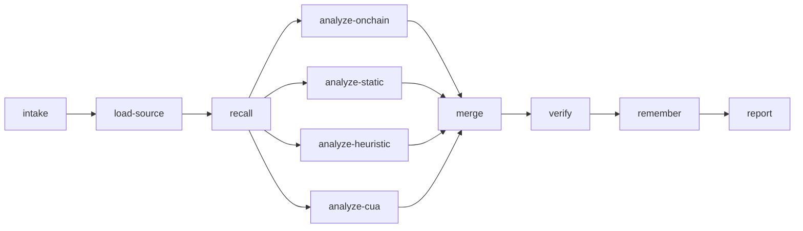

ARES models an audit as a **LangGraph** state machine. The analysis phase fans out to multiple analyzers in parallel, then merges results before verification and report synthesis.

## Pipeline overview

## Analyzers

Four analyzers append findings in parallel:

| Analyzer | Input | What it finds |
| -------- | ----- | ------------- |
| **On-chain** | Program account via Solana RPC | Deployment posture: upgrade authority, owner, loader. Not bytecode disassembly. |
| **Static** | Local `.rs` via Semgrep (`rules/`) | Pattern matches from committed ruleset. |
| **Heuristic** | Loaded source + intake + recalled memory | LLM reasoning; must cite files actually read. |
| **CUA** | Browser investigation (opt-in) | External evidence from explorers, repos, docs. |

### Analyzer outcomes

Each analyzer reports a status — **never infer “clean” from zero findings alone**:

| Outcome | Meaning |
| ------- | ------- |
| `ok` | Ran against real input. |
| `skipped` | Not applicable or opt-in disabled. |
| `degraded` | Ran with missing capability or bad output. |
| `failed` | Attempted and errored. |

When any analyzer is `degraded` or `failed`, the report **prepends a warning banner** in code (not left to the LLM).

## Recall (hybrid retrieval)

Recall merges three sources with reciprocal rank fusion:

1. **Crystalline** — in-process activation memory for the current session.
2. **Supabase** — `hybrid_search` RPC (pgvector + full-text).
3. **Neo4j** — lexical match + 1–2 hop graph expansion.

Unconfigured backends are `skipped`; configured backends that error are `failed` and appear in the assurance banner.

## Remember (writeback)

The **Remember** phase persists selected fragments to:

- Crystalline (session)
- Supabase + Neo4j (when configured), using the same ID scheme as `npm run ingest:solsec`

Writeback **never throws** — audit completion is not blocked by persistence errors.

## Report

The final report includes:

- Severity matrix and stable finding IDs
- Coverage by vulnerability category
- Analyzer and retrieval status tables
- Methodology describing what ran vs. was skipped

<Info>
  Heuristic findings that cite files not in the loaded source set are demoted to **speculative**.
</Info>
