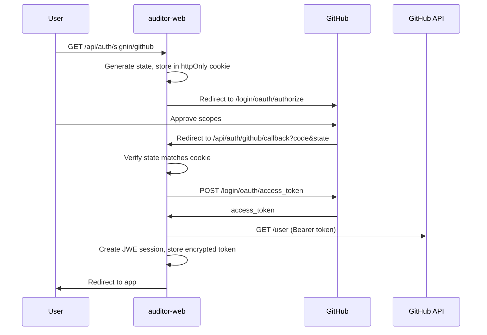

ARES uses GitHub in **two separate places**. They use **different OAuth apps** and **different callback URLs** — do not mix them up.

| Flow | Purpose | Callback URL |
| ---- | ------- | -------------- |
| **Dashboard OAuth** | Sign in to `apps/auditor-web` (tasks, JWE session) | `https://your-app.example.com/api/auth/github/callback` |
| **Supabase Auth** | Sign in for knowledge-base API access (JWT + RBAC) | `https://<project-ref>.supabase.co/auth/v1/callback` |

<Warning>
  One GitHub OAuth app cannot serve both callbacks. Create **two apps** on GitHub if you need both flows.
</Warning>

---

## Dashboard GitHub OAuth (auditor-web)

The shipping dashboard uses a **custom OAuth flow** (not Supabase Auth). It stores an encrypted JWE session and optionally links GitHub to a Vercel account for repo access.

### 1. Register a GitHub OAuth app (dashboard)

1. Go to [GitHub → OAuth apps](https://github.com/settings/developers) → **New OAuth App**
2. Set:
   - **Application name:** `ARES Auditor` (or your deployment name)
   - **Homepage URL:** your dashboard origin, e.g. `http://localhost:3000`
   - **Authorization callback URL:** `{origin}/api/auth/github/callback`
     - Local: `http://localhost:3000/api/auth/github/callback`
     - Production: `https://auditor.example.com/api/auth/github/callback`
3. Copy **Client ID** and generate a **Client secret**

### 2. Configure the dashboard

Add to `apps/auditor-web/.env.local`:

```env
NEXT_PUBLIC_AUTH_PROVIDERS=github
NEXT_PUBLIC_GITHUB_CLIENT_ID=Ov23li...
GITHUB_CLIENT_SECRET=...
JWE_SECRET=<random-32+-char-secret>
ENCRYPTION_KEY=<random-32+-char-secret>
POSTGRES_URL=postgres://...
```

Enable GitHub in providers:

```env
NEXT_PUBLIC_AUTH_PROVIDERS=github,vercel
```

### 3. Sign in

Users click **Sign in with GitHub** in the dashboard. The app redirects to:

```
/api/auth/signin/github
```

After authorization, GitHub redirects to `/api/auth/github/callback`, which creates a session in the dashboard Postgres `users` table.

<Tip>
  Vercel users can **connect** GitHub as a secondary account without signing out. The sign-in route detects an existing Vercel session and switches to connect mode automatically.
</Tip>

### OAuth authorization flow

The dashboard implements GitHub's standard **web application flow** (authorization code grant). GitHub does not support the implicit grant for new apps.



#### Step 1 — Request authorization

The sign-in route builds this request (see `apps/auditor-web/app/api/auth/signin/github/route.ts`):

```
GET https://github.com/login/oauth/authorize
  ?client_id={NEXT_PUBLIC_GITHUB_CLIENT_ID}
  &redirect_uri={origin}/api/auth/github/callback
  &scope=repo,read:user,user:email
  &state={random}
```

| Parameter | ARES usage |
| --------- | ---------- |
| `client_id` | From `NEXT_PUBLIC_GITHUB_CLIENT_ID` |
| `redirect_uri` | Must match the OAuth app callback URL exactly |
| `scope` | `repo` (private repos for tasks), `read:user`, `user:email` |
| `state` | Random string in an httpOnly cookie — **required** for CSRF protection |

<Warning>
  GitHub strongly recommends **PKCE** (`code_challenge` / `code_verifier`). The dashboard does not send PKCE today; consider adding it for new deployments. See [GitHub OAuth docs](https://docs.github.com/en/apps/oauth-apps/building-oauth-apps/authorizing-oauth-apps).
</Warning>

#### Step 2 — Handle the callback

GitHub redirects with `?code=...&state=...`. The callback route:

1. Compares `state` to the cookie — aborts with `400` on mismatch
2. Exchanges `code` for a token via `POST https://github.com/login/oauth/access_token`
3. Re-fetches `GET https://api.github.com/user` to confirm identity (GitHub recommends this on every sign-in)
4. Creates a JWE session or links the token to an existing Vercel user

The authorization `code` expires after **10 minutes**.

#### Step 3 — Use the token

Stored tokens are encrypted (`ENCRYPTION_KEY`) in Postgres. The app calls GitHub as the user, for example listing repos and creating pull requests from agent tasks.

#### Sign-in vs connect

| Mode | When | Result |
| ---- | ---- | ------ |
| **Sign-in** | No existing session | New dashboard user + JWE cookie |
| **Connect** | Signed in with Vercel | GitHub token linked in `accounts` table |

### Redirect URL rules

GitHub validates `redirect_uri` against your OAuth app callback URL:

| Callback registered | Valid `redirect_uri` | Invalid |
| ------------------- | -------------------- | ------- |
| `http://localhost:3000/api/auth/github/callback` | Same path, or subpath under it | Different host/port |
| `https://auditor.example.com/api/auth/github/callback` | `https://auditor.example.com/api/auth/github/callback` | `http://...`, wrong domain |

For local dev, register **`http://localhost:3000/api/auth/github/callback`** (or `127.0.0.1`). Loopback ports can differ for native apps, but the dashboard uses a fixed callback path on the Next.js origin.

### OAuth scopes

Scopes **limit** what the token can do. They never grant access beyond what the signed-in user already has. GitHub shows requested scopes on the authorization screen before the user approves.

#### What ARES requests (dashboard)

The sign-in route sends a space-separated `scope` parameter (URL-encoded as `%20` between values):

```
repo read:user user:email
```

In code this is `repo,read:user,user:email` — GitHub accepts comma or space separation in the authorize URL.

| Scope | What it allows | Why ARES needs it |
| ----- | -------------- | ----------------- |
| **`repo`** | Read/write access to **public and private** repositories — code, commits, collaborators, webhooks, PRs | Clone private repos for agent tasks, push branches, open/update pull requests |
| **`read:user`** | Read profile data (login, avatar, name) | Display signed-in user; build session identity |
| **`user:email`** | Read email addresses | Account linking; falls back to `GET /user/emails` when the primary email is private |

<Note>
  GitHub **normalizes** scopes on the token. `user:email` is implicitly included when `user` is granted, but ARES requests it explicitly so the consent screen lists email access clearly.
</Note>

#### Scopes ARES does *not* request

| Scope | Why not |
| ----- | ------- |
| `admin:org`, `write:org` | No organization administration |
| `gist` | No gist integration |
| `workflow` | GitHub Actions workflow edits use repo access where needed; no separate workflow scope today |
| `delete_repo` | Never deletes repositories |
| `(no scope)` | Insufficient — private repo tasks require `repo` |

For **public repositories only**, a lighter alternative is `public_repo` instead of `repo` — but private-repo audits would fail. ARES defaults to `repo` for the coding-agent task flow.

#### Granted vs requested scopes

Users can **reduce** scopes after authorizing (GitHub → Settings → Applications). The token's effective scopes may be smaller than requested.

ARES stores the granted scope string on sign-in (`users.scope` / `accounts.scope`). If a user drops `repo`:

- Repo list may show only public repos
- Sandbox/PR flows fail with GitHub `403` or empty repo pickers

**Recovery:** ask the user to re-authorize via **Sign in with GitHub** or reconnect from account settings. Do not assume the token still has `repo` after months idle — users may have edited scopes.

#### Verify token scopes (debugging)

Inspect response headers from any GitHub API call:

```bash
curl -sI -H "Authorization: Bearer gho_xxxx" https://api.github.com/user
```

| Header | Meaning |
| ------ | ------- |
| `X-OAuth-Scopes` | Scopes **granted** on this token |
| `X-Accepted-OAuth-Scopes` | Scopes the **endpoint** checks for |

Example:

```
X-OAuth-Scopes: read:user, repo, user:email
X-Accepted-OAuth-Scopes: user
```

#### GitHub App vs OAuth app

GitHub recommends **GitHub Apps** with fine-grained permissions for new integrations. ARES dashboard uses a classic **OAuth app** (from the coding-agent template) because it needs user-delegated repo access across arbitrary user repositories. See [Differences between GitHub Apps and OAuth apps](https://docs.github.com/en/apps/oauth-apps/building-oauth-apps/differences-between-github-apps-and-oauth-apps).

#### Supabase GitHub Auth scopes

Supabase manages its own GitHub OAuth authorize request when you enable the GitHub provider. Typical scopes are **`read:user`** and **`user:email`** for identity only — not `repo`. Knowledge-base login does not clone repositories.

#### Reference

Full scope list: [Scopes for OAuth apps](https://docs.github.com/en/apps/oauth-apps/building-oauth-apps/scopes-for-oauth-apps) · Multiple scopes in one request: join with `%20` in the authorize URL, e.g. `scope=read:user%20repo`

Request only what you need. GitHub allows up to **10 active tokens** per user/app/scope combination.

### Sign out and token revocation

Signing out calls `DELETE https://api.github.com/applications/{client_id}/token` to revoke the stored access token, then clears the JWE session cookie.

Users can also review or revoke access at:

```
https://github.com/settings/connections/applications/{client_id}
```

### Troubleshooting

| Symptom | Likely cause | Fix |
| ------- | -------------- | --- |
| `Invalid OAuth state` | State cookie missing, expired (10 min), or CSRF mismatch | Retry sign-in; don't open callback in a different browser |
| `redirect_uri mismatch` | Callback URL doesn't match GitHub app settings | Align OAuth app callback with `{origin}/api/auth/github/callback` |
| `github_not_configured` | Missing env vars | Set `NEXT_PUBLIC_GITHUB_CLIENT_ID` and `GITHUB_CLIENT_SECRET` |
| Token exchange 400 | Expired code or wrong client secret | Restart flow; verify secret in GitHub app settings |
| Repo access denied | User denied `repo` scope or token revoked | Re-authorize; check [connections page](https://github.com/settings/applications) |
| Private repo missing in picker | Token lacks `repo` (user reduced scopes) | Re-sign in; verify `X-OAuth-Scopes` includes `repo` |
| PR/push fails with 403 | Insufficient scope for target repo | Confirm user has repo access and token includes `repo` |

See GitHub's [authorization error troubleshooting](https://docs.github.com/en/apps/oauth-apps/maintaining-oauth-apps/troubleshooting-authorization-request-errors).

### Device flow (not used today)

GitHub's **device flow** is for headless CLIs (`POST /login/device/code`). ARES CLI audits do not use GitHub OAuth — enable device flow only if you build a standalone CLI that needs user GitHub access.

<Warning>
  GitHub recommends **authorization code + PKCE** over device flow for public clients. Device flow has no redirect URI, which makes phishing easier. Do not enable device flow on your OAuth app unless the client truly cannot use a browser (CLI, IoT, headless).
</Warning>

### Security best practices

GitHub's [OAuth app security guidance](https://docs.github.com/en/apps/oauth-apps/building-oauth-apps/best-practices-for-creating-an-oauth-app) applies to both the dashboard and Supabase flows. Below is how ARES aligns today and what operators should add for production.

#### Prefer a GitHub App when starting fresh

GitHub Apps use **fine-grained permissions**, **repository-level install control**, and **short-lived user access tokens** — generally safer than classic OAuth apps if credentials leak.

ARES dashboard still uses a **classic OAuth app** (inherited from the coding-agent template) because it needs user-delegated access across arbitrary repositories without a per-repo install step. For greenfield integrations, evaluate a GitHub App first. See [Migrating OAuth apps to GitHub Apps](https://docs.github.com/en/apps/creating-github-apps/about-creating-github-apps/migrating-oauth-apps-to-github-apps).

#### Request minimal scopes

Request only scopes required for your deployment. ARES defaults to `repo`, `read:user`, and `user:email` for private-repo agent tasks — see [OAuth scopes](#oauth-scopes). If you only audit public repos, consider `public_repo` instead of `repo` to limit blast radius if a token leaks.

#### Authorize thoroughly on every sign-in

After OAuth completes, treat access as **session-specific**, not permanent:

| Practice | ARES today | Recommendation |
| -------- | ---------- | -------------- |
| Re-fetch identity on sign-in | Callback calls `GET /user` after token exchange | Keep this on every auth |
| Store users by durable GitHub **`id`** | `accounts.externalUserId` = numeric GitHub user ID | Never key users by login, email, or org slug alone |
| Store repos by durable **`id`** | Tasks store `repoUrl` (owner/name) | Prefer numeric repo ID where possible for renames |
| Re-check org membership / SAML SSO | Not automated | For enterprise: poll org access; block org-owned data if SSO lapses |
| Tag cached data with org context | Tasks tied to `userId` only | For multi-tenant SaaS: scope sandboxes and exports by org |

**Org access example:** A user leaves an organization but still has an ARES session. Without org-context checks, they might retain cloned code in sandboxes. For org deployments, re-validate GitHub access before showing tasks and purge org-scoped artifacts when membership ends.

**Enterprise-only apps:** If the dashboard is internal-only, allowlist GitHub orgs on sign-in via [`GET /user/orgs`](https://docs.github.com/en/rest/orgs/orgs#list-organizations-for-the-authenticated-user) and reject others.

#### Secure credentials and tokens

| Secret | Where | Notes |
| ------ | ----- | ----- |
| `GITHUB_CLIENT_SECRET` | Server env only (`apps/auditor-web/.env.local`, Vercel secrets) | Never prefix with `NEXT_PUBLIC_` or commit to git |
| `ENCRYPTION_KEY` | Server env | Encrypts GitHub access tokens in Postgres (`accounts.accessToken`) |
| `JWE_SECRET` | Server env | Signs dashboard session cookies |
| Supabase GitHub secret | Supabase Dashboard / env | Separate OAuth app; not shared with dashboard |

The dashboard is a **confidential client** (Next.js server holds the client secret). Store secrets in a vault (e.g. Vercel/Railway secrets, Azure Key Vault) — not in the repo.

User access tokens live **encrypted on the server**, not in browser localStorage. Sign-out revokes the token via GitHub's API (see [Sign out and token revocation](#sign-out-and-token-revocation)).

<Warning>
  Do **not** authenticate with personal access tokens or GitHub passwords in application code. OAuth user access tokens only.
</Warning>

**PKCE:** GitHub recommends `code_challenge` / `code_verifier` for all OAuth clients. The dashboard does not send PKCE yet — add it before exposing auth to untrusted origins.

#### Breach response

Plan ahead:

1. **Client secret leaked** — rotate in GitHub OAuth app settings, update deployment env, delete the old secret.
2. **User tokens leaked** — revoke via [`DELETE /applications/{client_id}/token`](https://docs.github.com/en/rest/apps/oauth-applications#delete-an-app-token) or ask users to revoke at GitHub → Settings → Applications.
3. **Database compromise** — rotate `ENCRYPTION_KEY` and `JWE_SECRET`, invalidate all sessions, force re-auth (tokens are encrypted but assume breach).

#### Operations hygiene

| Area | Guidance |
| ---- | -------- |
| **Dependency & secret scanning** | CI runs license checks; enable GitHub code scanning and secret scanning on the deployment repo |
| **Environment** | Run dashboard on hardened hosts; rate-limit auth routes (ARES has basic rate limiting on session APIs) |
| **Third-party services** | Unique credentials per service; no shared admin accounts for Postgres, email, or hosting |
| **Logging** | Log auth success/failure, token exchange errors, and scope mismatches — avoid logging raw tokens |
| **Data deletion** | Provide a path for users to delete account data (tasks, tokens, connectors); document in your privacy policy |

For Marketplace apps, see GitHub's [Marketplace security best practices](https://docs.github.com/en/apps/github-marketplace/creating-apps-for-github-marketplace/security-best-practices-for-apps-on-github-marketplace).

---

## Supabase GitHub Auth (knowledge base)

Use Supabase Auth when browser clients need **JWT-backed access** to `documents`, `chunks`, and `hybrid_search` with RLS and the `user_role` claim from `custom_access_token_hook`.

### 1. Find your Supabase callback URL

1. Open [Supabase Dashboard](https://supabase.com/dashboard) → your project
2. **Authentication** → [**Providers**](https://supabase.com/dashboard/project/_/auth/providers) → **GitHub**
3. Copy the **Callback URL**:

```
https://<project-ref>.supabase.co/auth/v1/callback
```

For the ARES Supabase project, replace `<project-ref>` with your project reference (e.g. `dzrchlticyhalygqzonr`).

<Note>
  **Local Supabase CLI:** use `http://127.0.0.1:54321/auth/v1/callback` (or `http://localhost:54321/auth/v1/callback`) as the callback when testing with `supabase start`.
</Note>

### 2. Register a second GitHub OAuth app (Supabase)

Create a **separate** OAuth app from the dashboard one:

1. [Register a new OAuth application](https://github.com/settings/applications/new)
2. **Authorization callback URL:** paste the Supabase callback URL from step 1
3. Save **Client ID** and **Client secret**

### 3. Enter credentials in Supabase

**Dashboard:**

1. **Authentication** → **Providers** → **GitHub**
2. Enable **GitHub Enabled**
3. Paste Client ID and Client secret → **Save**

**CLI (`supabase/config.toml`):**

```toml
[auth.external.github]
enabled = true
client_id = "env(SUPABASE_AUTH_EXTERNAL_GITHUB_CLIENT_ID)"
secret = "env(SUPABASE_AUTH_EXTERNAL_GITHUB_SECRET)"
```

Set env vars when running locally:

```bash
export SUPABASE_AUTH_EXTERNAL_GITHUB_CLIENT_ID=Ov23li...
export SUPABASE_AUTH_EXTERNAL_GITHUB_SECRET=...
```

**Management API (optional):**

```bash
export SUPABASE_ACCESS_TOKEN="your-access-token"
export PROJECT_REF="your-project-ref"

curl -X PATCH "https://api.supabase.com/v1/projects/$PROJECT_REF/config/auth" \
  -H "Authorization: Bearer $SUPABASE_ACCESS_TOKEN" \
  -H "Content-Type: application/json" \
  -d '{
    "external_github_enabled": true,
    "external_github_client_id": "your-github-client-id",
    "external_github_secret": "your-github-client-secret"
  }'
```

### 4. Redirect URLs

Add your app URLs to Supabase **Authentication → URL configuration → Redirect URLs**:

- `http://localhost:3000/**` (local dashboard)
- `https://auditor.example.com/**` (production)

These are where Supabase sends the user **after** OAuth completes (PKCE code exchange), not the GitHub callback.

### 5. Client sign-in code

Browser client using `@supabase/supabase-js`:

```typescript
import { createClient } from '@supabase/supabase-js'

const supabase = createClient(
  process.env.NEXT_PUBLIC_SUPABASE_URL!,
  process.env.NEXT_PUBLIC_SUPABASE_ANON_KEY!,
)

async function signInWithGithub() {
  const { error } = await supabase.auth.signInWithOAuth({
    provider: 'github',
    options: {
      redirectTo: `${window.location.origin}/auth/callback`,
    },
  })
  if (error) console.error(error)
}
```

### 6. Next.js callback (PKCE)

Create `app/auth/callback/route.ts` in your Next.js app to exchange the OAuth code for a session:

```typescript
import { NextResponse } from 'next/server'
import { createClient } from '@/lib/supabase/server'

export async function GET(request: Request) {
  const { searchParams, origin } = new URL(request.url)
  const code = searchParams.get('code')
  let next = searchParams.get('next') ?? '/'
  if (!next.startsWith('/')) next = '/'

  if (code) {
    const supabase = await createClient()
    const { error } = await supabase.auth.exchangeCodeForSession(code)
    if (!error) {
      return NextResponse.redirect(`${origin}${next}`)
    }
  }

  return NextResponse.redirect(`${origin}/auth/auth-code-error`)
}
```

Use the [Supabase Server-Side Auth guide](https://supabase.com/docs/guides/auth/server-side/creating-a-client) to set up cookie-based `createClient` for Next.js App Router.

### 7. Assign RBAC role

After the first GitHub sign-in via Supabase:

1. **Authentication → Users** — find the user (GitHub email is available unlike Web3)
2. Grant a role:

```sql
insert into public.user_roles (user_id, role)
values ('<auth-user-uuid>', 'auditor');
```

See [Knowledge base](/guides/knowledge-base) for role permissions.

### 8. Sign out

```typescript
await supabase.auth.signOut()
```

---

## Environment summary

| Variable | Used by | Purpose |
| -------- | ------- | ------- |
| `NEXT_PUBLIC_GITHUB_CLIENT_ID` | Dashboard | Dashboard OAuth app ID |
| `GITHUB_CLIENT_SECRET` | Dashboard (server) | Dashboard OAuth secret |
| `NEXT_PUBLIC_SUPABASE_URL` | Supabase client | Project URL |
| `NEXT_PUBLIC_SUPABASE_ANON_KEY` | Supabase client | Browser Auth |
| GitHub credentials in Supabase Dashboard | Supabase Auth | **Separate** OAuth app |

---

## Which flow should I use?

| Need | Use |
| ---- | --- |
| Task UI, coding-agent template features | **Dashboard OAuth** (already wired) |
| Read/write knowledge base from browser with RLS | **Supabase GitHub Auth** |
| Solana wallet, no GitHub account | [Sign in with Web3](/guides/web3-auth) |
| CLI audits, ingest, agent recall | `SUPABASE_SERVICE_ROLE_KEY` (no user login) |

Unifying dashboard session and Supabase Auth into one login is planned integration work (**INT-4**). Until then, treat them as independent.

## Related

- [Dashboard](/guides/dashboard) — local dev and env vars
- [Knowledge base](/guides/knowledge-base) — RBAC and migrations
- [Sign in with Web3](/guides/web3-auth) — wallet alternative
- [Supabase: Login with GitHub](https://supabase.com/docs/guides/auth/social-login/auth-github) — upstream reference
- [GitHub: Authorizing OAuth apps](https://docs.github.com/en/apps/oauth-apps/building-oauth-apps/authorizing-oauth-apps) — authorization code flow, PKCE, device flow
- [GitHub: Scopes for OAuth apps](https://docs.github.com/en/apps/oauth-apps/building-oauth-apps/scopes-for-oauth-apps) — full scope reference
- [GitHub: Best practices for creating an OAuth app](https://docs.github.com/en/apps/oauth-apps/building-oauth-apps/best-practices-for-creating-an-oauth-app) — security and operations guidance
