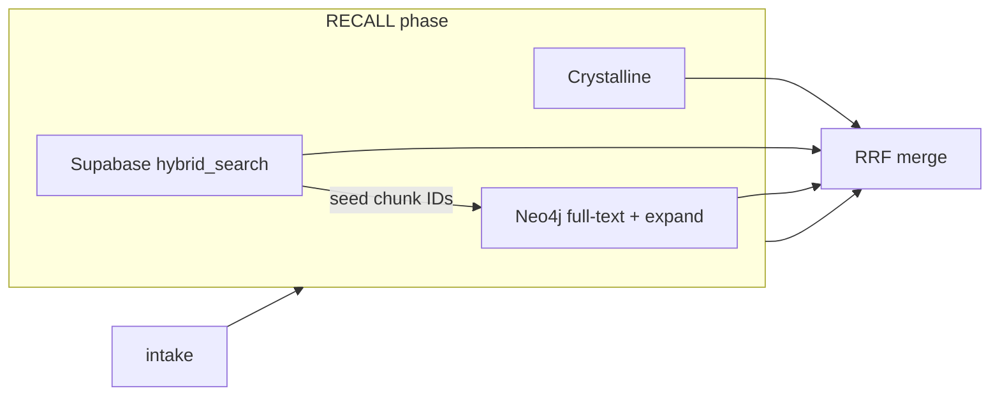

ARES uses **Neo4j** as an optional third leg of hybrid recall alongside Crystalline (session memory) and Supabase (pgvector + full-text). The graph adds **lexical search over chunks** and **1–2 hop expansion** from Supabase seed hits — useful when relationships between vulnerability patterns, programs, and entities matter as much as the text itself.

<Note>
  Without Neo4j, recall still works via Crystalline and/or Supabase. The agent reports `neo4j: skipped` in the assurance banner when unconfigured.
</Note>

## How ARES uses Neo4j



| Stage | What Neo4j does |
| ----- | ---------------- |
| **Standalone retrieve** | Full-text search on `Chunk.content` via `chunk_content` index |
| **Graph expand** | From Supabase seed chunks, traverse 1–2 hops to related chunks; closer hops score higher |
| **Remember / ingest** | Writes `Document`, `Chunk`, `Entity` nodes with the same IDs as Supabase |

Implementation: `src/retrieval/neo4j-retriever.ts` · Schema: `db/neo4j/schema.cypher`

## Graph schema

```
(:Document { doc_id, title, path })
  -[:HAS_CHUNK]->
(:Chunk { chunk_id, content, chunk_index, embedding? })
  -[:MENTIONS]->
(:Entity { entity_id, name })
```

IDs mirror Supabase keys so both stores join on `doc_id` / `chunk_id` / `entity_id`.

Indexes applied by `npm run db:migrate`:

- Unique constraints on `doc_id`, `chunk_id`, `entity_id`
- Full-text index `chunk_content` on `Chunk.content`
- Vector index `chunk_embedding` (1536-dim cosine) — reserved for future semantic graph search; ingest today uses full-text + expansion

## Environment variables

Set in root `.env` (see `.env.example`):

```env
NEO4J_URI=bolt://localhost:7687
NEO4J_USER=neo4j
NEO4J_PASSWORD=ares_dev_password
NEO4J_TIMEOUT_MS=15000
```

| Variable | Notes |
| -------- | ----- |
| `NEO4J_URI` | Local: `bolt://localhost:7687` · Aura: `neo4j+s://<id>.databases.neo4j.io` |
| `NEO4J_USER` | Always `neo4j` for default installs (**not** `NEO4J_USERNAME`) |
| `NEO4J_PASSWORD` | From Aura download or Docker `NEO4J_AUTH` |
| `NEO4J_TIMEOUT_MS` | Connect, pool, and query deadline — unbounded queries stall RECALL |

<Warning>
  Aura `.env` downloads often use `NEO4J_USERNAME`. ARES reads **`NEO4J_USER`** — rename when copying credentials.
</Warning>

## Local development (Docker)

The repo ships Neo4j in `docker-compose.yml`:

```bash
npm run db:up       # postgres + neo4j
npm run db:migrate  # checkpoint tables + db/neo4j/schema.cypher
```

- **Browser UI:** http://localhost:7474 (login `neo4j` / `ares_dev_password`)
- **Bolt:** `bolt://localhost:7687`

Stop with `npm run db:down`.

## Neo4j Aura (cloud)

1. Create a free instance: [Aura Free](https://neo4j.com/cloud/aura-free/)
2. Download credentials — URI uses **`neo4j+s://`**
3. Add to `.env`:

```env
NEO4J_URI=neo4j+s://xxxxxxxx.databases.neo4j.io
NEO4J_USER=neo4j
NEO4J_PASSWORD=<from-aura>
NEO4J_TIMEOUT_MS=15000
```

4. Apply schema:

```bash
npm run db:migrate
```

5. Ingest corpus:

```bash
npm run ingest:solsec
```

## Ingest and writeback

| Command | Neo4j effect |
| ------- | ------------- |
| `npm run ingest:solsec` | MERGE documents, chunks, entities from solsec corpus |
| Audit **Remember** phase | Non-fatal writeback of selected fragments (same ID scheme) |

Ingest requires **at least one** of Supabase or Neo4j configured. Embeddings improve Supabase semantic leg; Neo4j ingest uses entity extraction from chunk text.

## Recall outcomes in reports

The report **Scope & Methodology** table includes Neo4j status:

| Outcome | Meaning |
| ------- | ------- |
| `ok` | Queries ran; fragment count shown |
| `skipped` | `NEO4J_URI` / `NEO4J_USER` / `NEO4J_PASSWORD` not all set |
| `failed` | Query or connection error — check logs for `neo4j-retriever` |

Neo4j failures **degrade gracefully** — the audit continues with other recall sources.

## Troubleshooting

| Symptom | Fix |
| ------- | --- |
| `neo4j: skipped` | Set all three credentials in `.env` |
| Auth failed | Verify password; Aura resets require re-download |
| `ServiceUnavailable` | Check URI scheme (`neo4j+s://` for Aura) and network |
| Zero graph fragments | Run `npm run db:migrate` and `npm run ingest:solsec` |
| Full-text syntax errors | ARES escapes Lucene operators in `toLuceneQuery()` — raw Cypher in Browser may differ |

## MCP server (optional, for authors)

Query or inspect the graph from Cursor via the [Neo4j MCP server](https://neo4j.com/docs/mcp/):

```json
{
  "mcpServers": {
    "neo4j": {
      "command": "neo4j-mcp",
      "env": {
        "NEO4J_URI": "bolt://localhost:7687",
        "NEO4J_USERNAME": "neo4j",
        "NEO4J_PASSWORD": "ares_dev_password",
        "NEO4J_DATABASE": "neo4j",
        "NEO4J_READ_ONLY": "true"
      }
    }
  }
}
```

Install: `pip install neo4j-mcp-server` · Project config: `.cursor/mcp.json`

Tools: `get-schema`, `read-cypher`, `write-cypher` (disable writes with `NEO4J_READ_ONLY=true`).

<Tip>
  Read [neo4j.com/llms.txt](https://neo4j.com/llms.txt) first for Cypher patterns, output shaping for agents, and deprecated syntax to avoid.
</Tip>

## Cybersecurity relevance

For Solana security auditing, graph recall helps when:

- The same vulnerability class appears across multiple programs or incidents
- Entity links (program, authority, token, CVE) connect scattered write-ups
- Multi-hop questions need related chunks, not just the nearest vector match

ARES does **not** run GDS algorithms or GraphRAG LLM pipelines in the core path — it uses targeted full-text + bounded expansion for deterministic, auditable recall.

## Related

- [Knowledge base](/guides/knowledge-base) — Supabase migrations and RBAC
- [Configuration](/configuration) — full environment reference
- [Neo4j getting started](https://neo4j.com/docs/getting-started/) — upstream docs
- [GraphRAG](https://neo4j.com/docs/neo4j-graphrag-python/) — advanced pipelines (not wired in core ARES today)
