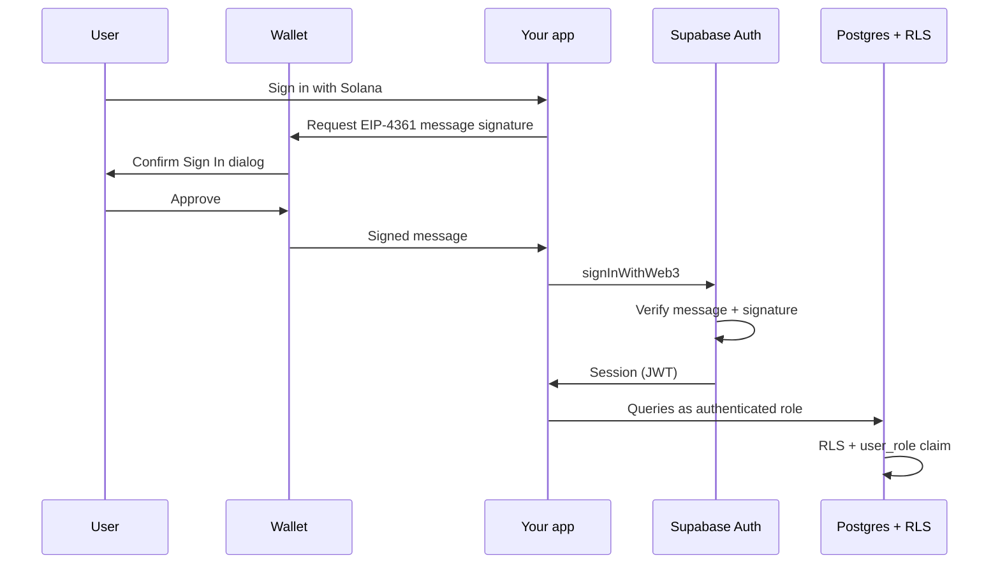

ARES can use **Supabase Sign in with Web3** so dashboard and knowledge-base clients authenticate with a wallet instead of email or OAuth. Wallet addresses become the user identity; your existing **RBAC** (`user_roles` + `custom_access_token_hook`) applies the same way as for any Supabase Auth user.

<Note>
  Web3 sign-in is for **browser clients** talking to Supabase with the **anon key**. The ARES CLI agent continues to use `SUPABASE_SERVICE_ROLE_KEY` for ingest and recall (bypasses RLS).
</Note>

## How it works

Sign in with Web3 uses [EIP-4361](https://eips.ethereum.org/EIPS/eip-4361) (Sign-In with Ethereum / Solana). The wallet signs a structured message; Supabase Auth verifies the signature, timestamp, domain, and URI before issuing a session.



Supported wallets include **all Solana wallets** and **all Ethereum wallets** that implement the standard.

## Enable the provider

<Steps>
  <Step title="Dashboard (production)">
    Open [Authentication → Providers](https://supabase.com/dashboard/project/_/auth/providers) for your project and enable **Web3 Wallet**.

    For ARES (Solana-first), enable at least **Solana**.
  </Step>

  <Step title="Local CLI (optional)">
    In `supabase/config.toml`:

    ```toml
    [auth.web3.solana]
    enabled = true

    # Optional — only if you need Ethereum wallets
    # [auth.web3.ethereum]
    # enabled = true
    ```
  </Step>

  <Step title="Redirect URLs">
    Register every URL where sign-in runs. Mismatch causes validation failure.

    Examples for local dashboard development:

    - `http://127.0.0.1:3000/`
    - `http://localhost:3000/`

    For production, add your deployed origin (trailing slash matters for exact URLs):

    - `https://auditor.example.com/`

    Or use a glob: `https://auditor.example.com/**`

    Configure in [Redirect URLs](https://supabase.com/docs/guides/auth/redirect-urls).
  </Step>

  <Step title="Auth hook (RBAC)">
    Ensure `public.custom_access_token_hook` is enabled under **Authentication → Hooks**, as described in [Knowledge base](/guides/knowledge-base).
  </Step>
</Steps>

## Environment variables

Browser clients need the **anon** key (safe to expose). Server-side ingest/recall keeps the **service role** key secret.

| Variable | Where | Purpose |
| -------- | ----- | ------- |
| `NEXT_PUBLIC_SUPABASE_URL` | Dashboard `.env.local` | Supabase project URL |
| `NEXT_PUBLIC_SUPABASE_ANON_KEY` | Dashboard `.env.local` | Client Auth + Data API |
| `SUPABASE_SERVICE_ROLE_KEY` | Root `.env` only | ARES agent (never in browser) |

Add to `apps/auditor-web/.env.local`:

```env
NEXT_PUBLIC_SUPABASE_URL=https://<project-ref>.supabase.co
NEXT_PUBLIC_SUPABASE_ANON_KEY=eyJ...
NEXT_PUBLIC_AUTH_PROVIDERS=github,solana
```

## Sign in with Solana

### Window API (Phantom and similar)

Most Solana wallets expose `window.solana`. Connect first, then sign in:

```typescript
import { createClient } from '@supabase/supabase-js'

const supabase = createClient(
  process.env.NEXT_PUBLIC_SUPABASE_URL!,
  process.env.NEXT_PUBLIC_SUPABASE_ANON_KEY!,
)

// Ensure wallet is connected (e.g. await window.solana.connect())
const { data, error } = await supabase.auth.signInWithWeb3({
  chain: 'solana',
  statement: 'I accept the ARES Auditor Terms of Service at https://example.com/tos',
})
```

The `statement` is **required** for most Solana wallets and appears in the wallet consent dialog.

### Wallet Adapter (recommended for production)

For multiple wallets, use [Solana Wallet Adapter](https://solana.com/developers/courses/intro-to-solana/interact-with-wallets) and pass the connected wallet:

```tsx
import { useWallet } from '@solana/wallet-adapter-react'
import { WalletMultiButton } from '@solana/wallet-adapter-react-ui'

function SignInButton() {
  const wallet = useWallet()

  return wallet.connected ? (
    <button
      onClick={() =>
        supabase.auth.signInWithWeb3({
          chain: 'solana',
          statement: 'I accept the ARES Auditor Terms of Service at https://example.com/tos',
          wallet,
        })
      }
    >
      Sign in with Solana
    </button>
  ) : (
    <WalletMultiButton />
  )
}
```

### Non-standard providers

If the user has multiple Solana extensions, pass the explicit wallet object:

```typescript
// Phantom
wallet: window.phantom

// Brave Wallet
wallet: window.braveSolana
```

## Assign roles to wallet users

Web3 accounts have **no email**. After the first sign-in:

1. Open Supabase Dashboard → **Authentication → Users**
2. Copy the user's UUID
3. Grant a role:

```sql
insert into public.user_roles (user_id, role)
values ('<auth-user-uuid>', 'viewer');
```

Roles: `admin`, `auditor`, `viewer`. See [Knowledge base](/guides/knowledge-base#roles-and-permissions).

<Tip>
  Default new Web3 users to `viewer` via a `before_user_created` hook if you want automatic provisioning instead of manual SQL.
</Tip>

## Abuse prevention

Wallet accounts are free to create and easy to automate. Mitigate abuse:

| Control | Where |
| ------- | ----- |
| Web3 rate limits | Dashboard → [Rate Limits](https://supabase.com/dashboard/project/_/auth/rate-limits) or `[auth.rate_limit] web3 = 30` in `config.toml` |
| CAPTCHA | [Auth CAPTCHA](https://supabase.com/docs/guides/auth/auth-captcha) |
| Strict redirect URLs | Only your app origins |
| Manual role assignment | Don't auto-grant `admin` |

```toml
[auth.rate_limit]
web3 = 30

# [auth.captcha]
# enabled = true
# provider = "hcaptcha"
# secret = "env(HCAPTCHA_SECRET)"
```

## Link email or OAuth later

Wallet-only users can attach email or social login later:

```typescript
await supabase.auth.updateUser({ email: 'user@example.com' })
// or
await supabase.auth.linkIdentity({ provider: 'github' })
```

## Ethereum (optional)

If you enable `[auth.web3.ethereum]`:

```typescript
const { data, error } = await supabase.auth.signInWithWeb3({
  chain: 'ethereum',
  statement: 'I accept the Terms of Service at https://example.com/tos',
})
```

For multiple Ethereum wallets, use [EIP-6963](https://eips.ethereum.org/EIPS/eip-6963) discovery and pass `wallet: selectedWallet`.

## Dashboard status

`apps/auditor-web` ships with GitHub and Vercel OAuth today. **Solana Web3** sign-in is configured via Supabase and documented here; wiring the wallet button into the dashboard UI is tracked as integration work (**INT-4**).

Until then, use Supabase Auth directly in a custom client, or enable Web3 for knowledge-base-only browser tools that call `documents` / `hybrid_search` with the user's JWT.

## Related

- [Login with GitHub](/guides/github-auth) — Supabase GitHub OAuth + dashboard OAuth
- [Knowledge base](/guides/knowledge-base) — RBAC and migrations
- [Dashboard](/guides/dashboard) — local dev for `apps/auditor-web`
- [Supabase: Sign in with Web3](https://supabase.com/docs/guides/auth/auth-web3) — upstream reference
